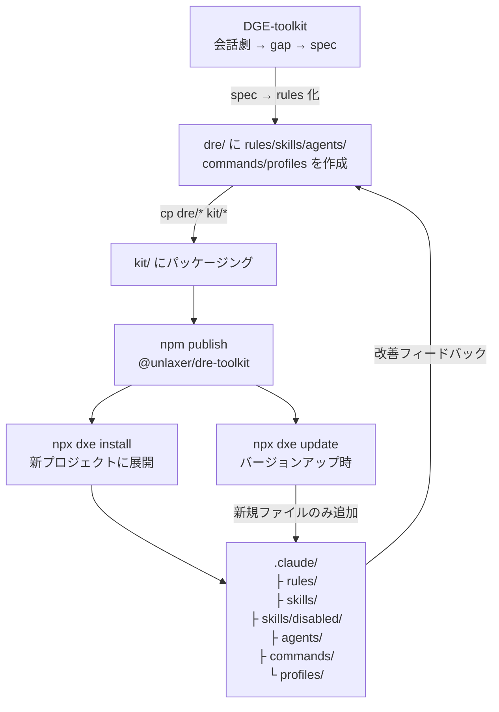
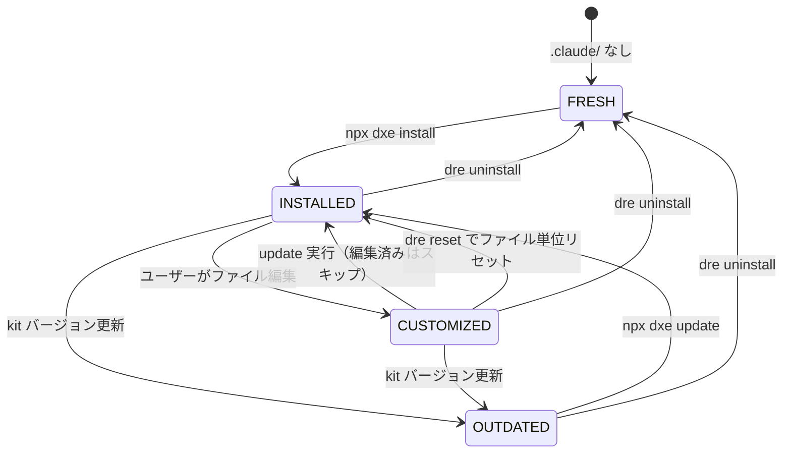

# DRE-toolkit — Document Rule Engine

> **「Claude Code の設定を手でコピーしていたら、それはワークフローではない。」**

DRE-toolkit は Claude Code の rules / skills / agents / commands / profiles を **npm パッケージとして配布・バージョン管理し、チームやプロジェクト間で再現可能なワークフローを強制する**ツールキット。

---

## awesome-* との違い

| | awesome-claude-skills など | DRE-toolkit |
|---|---|---|
| 目的 | 世界中のスキルを発見する | 自プロジェクトで同じ設定を再現する |
| 単位 | 単品スキル | システム一式（rules + skills + agents + commands + profiles） |
| 配布 | GitHub + 手動コピー | npm パッケージ（バージョン管理付き） |
| 更新 | 手動 | `npx dxe update`（カスタマイズ保護） |
| ワークフロー | なし | DGE → spec → DRE rules 化 → 全プロジェクトへ展開 |

最も近いアナロジーは **ESLint shareable config**。  
ルールセットを npm に乗せて、`npx dxe install` 一発でチーム全員が同じ Claude Code 環境で動く。

---

## ワークフロー

DRE-toolkit は単なるファイル置き場ではなく、**設計から展開までのパイプライン**。



1. **DGE** で会話劇を回し、設計の gap を spec に変換
2. **dre/** で spec を rules / skills / agents に落とし込む
3. **kit/** にパッケージングして `npm publish`
4. 新プロジェクトで `npx dxe install` → `.claude/` に全展開
5. 更新は `npx dxe update`（カスタマイズ済みファイルは保護）

---

## インストール状態の管理

`.claude/.dre-version` でバージョンを追跡し、カスタマイズと上書きを分離。



| コマンド | 遷移 | 内容 |
|---------|------|------|
| `npx dxe install` | FRESH → INSTALLED | 初回インストール |
| `npx dxe update` | OUTDATED → INSTALLED | 新規ファイルのみ追加 |
| `dre reset <file>` | CUSTOMIZED → INSTALLED（部分） | ファイル単位で kit 標準に戻す |
| `dre uninstall` | any → FRESH | DRE 管理ファイルをすべて削除 |

`update.sh` は `diff -q` で各ファイルを比較し、ユーザーが編集したファイルには触らない。新規ファイルのみ追加。  
`.dre-manifest` にインストール済みファイルのリストとハッシュを記録し、リセット・アンインストール時に利用する。

---

## スキルの有効化・無効化

スキルが増えすぎると Claude のコンテキストを圧迫する。不要なスキルは無効化できる。

```bash
# 一覧表示（有効/無効）
dre skills

# 無効化（skills/disabled/ に移動）
dre deactivate architect-to-task

# 有効化（skills/ に戻す）
dre activate architect-to-task
```

無効化されたスキルは `.claude/skills/disabled/` に保存される。`dxe update` 時も更新されるため、有効化したとき常に最新版が使われる。

**常時有効（保護）:** `dxe-command.md` / `dre-activate.md`

---

## 使い方

```bash
# 新プロジェクトに展開（DxE-suite 経由）
npx dxe install

# アップデート（カスタマイズ済みファイルは保護）
npx dxe update

# 状態確認
npx dxe status
```

展開後、Claude Code で:
```
「dxe update」          →  全 toolkit を最新版に更新
「dre skills」          →  スキル一覧（有効/無効）
「dre deactivate xxx」  →  スキルを無効化
「dre reset xxx.md」    →  ファイルを kit 標準に戻す
「dre uninstall」       →  DRE をすべて削除して FRESH に戻す
```

---

## 構造

```
DRE-toolkit/
├── kit/               # npm パッケージ (@unlaxer/dre-toolkit)
│   ├── rules/         # → .claude/rules/
│   │   └── dre-skill-control.md  # disabled/ スキルの無視ルール
│   ├── skills/        # → .claude/skills/
│   │   ├── dxe-command.md    # dxe install/update/status
│   │   ├── dre-activate.md   # スキル有効化・無効化
│   │   ├── dre-reset.md      # ファイル単位リセット
│   │   ├── dre-uninstall.md  # アンインストール
│   │   └── ...               # プロジェクト運用スキル各種
│   ├── agents/        # → .claude/agents/
│   ├── commands/      # → .claude/commands/
│   ├── profiles/      # → .claude/profiles/
│   ├── bin/dre-tool.js
│   ├── install.sh     # npx dre-install の実体（.dre-manifest 生成）
│   └── update.sh      # npx dre-update の実体（disabled/ も更新）
├── dre/               # 開発中の作業コピー（kit/ の手前）
├── design-materials/  # 設計資料 (intake → reviews → finalize)
└── docs/
    ├── flows.md       # 全フロー図（詳細版）
    └── strategy.md    # 戦略・世界比較・課題
```

---

## D*E シリーズ

```
DGE — Design-Gap Extraction       設計の穴を会話劇で発見  →  spec
DDE — Document-Deficit Extraction ドキュメントの穴を補完   →  docs
DRE — Document Rule Engine        rules/skills を配布      →  .claude/
```

DGE / DDE / DRE をまとめて使う場合は [@unlaxer/dxe-suite](https://github.com/opaopa6969/DxE-suite)。
