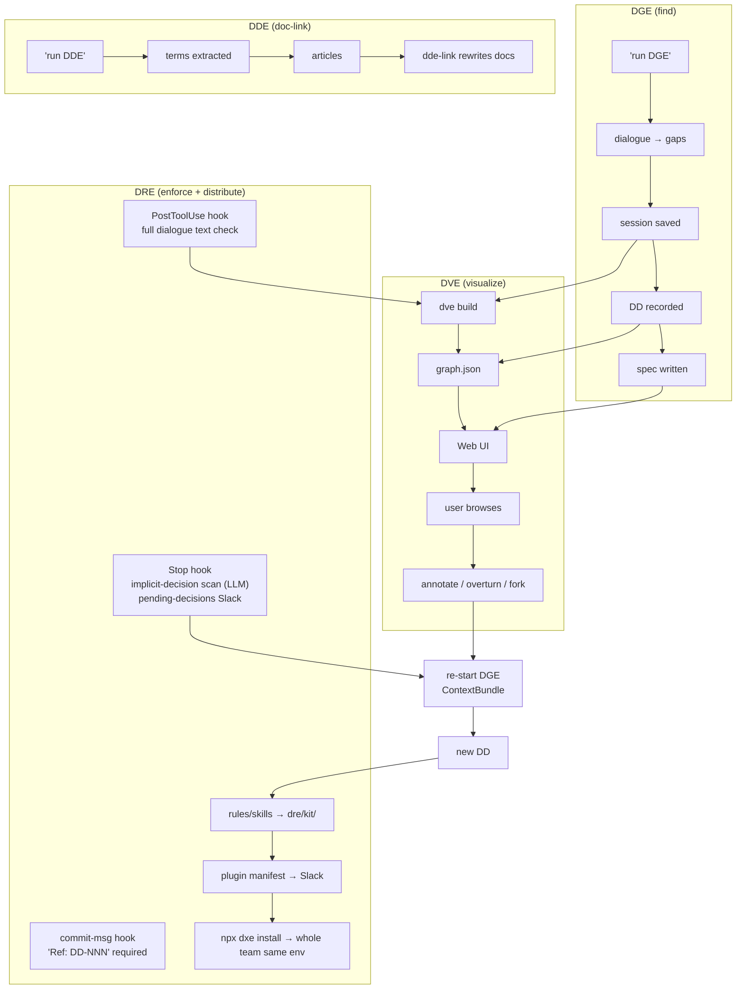

[日本語版はこちら / Japanese](README-ja.md)

# DxE-suite

A monorepo that bundles the **four D\*E toolkits** — DGE, DDE, DVE, DRE — into a single installable suite (**v4.2.0**).

> **DxE** = **D**esign × **E**xtraction + **E**nforcement + **E**ngine. One suite, one lifecycle:
> *find the gaps* (DGE/DDE) → *visualize the decisions* (DVE) → *distribute and enforce the rules* (DRE).

```
D*E series:
  DGE — Design-Gap Extraction         find holes in the design via dialogue drama
  DDE — Document-Deficit Extraction   find holes in the docs via LLM + CLI, auto-link glossary
  DVE — Decision Visualization Engine visualize the decision graph, hub for re-starting DGE
  DRE — Document Rule Engine          package rules/skills/hooks, enforce them with hooks
```

**Read**: [Architecture](docs/architecture.md) | [Getting Started](docs/getting-started.md) | [Migration from dde-toolkit](docs/migration-from-dde-toolkit.md) | [CHANGELOG](CHANGELOG.md)

**ADRs**: [0001 — Remove Stop(LLM prompt) hook](docs/decisions/0001-remove-stop-llm-prompt-hook.md) | [0002 — Archive DDE into the monorepo](docs/decisions/0002-archive-dde-into-monorepo.md)

---

## Canonical location

**This monorepo is the canonical implementation** of DGE, DDE, DVE, and DRE.

- Source of truth: `dge/`, `dde/`, `dre/`, `dve/` in **this repository** (`opaopa6969/DxE-suite`, v4.2.0+).
- The former standalone repository [`opaopa6969/DDE-toolkit`](https://github.com/opaopa6969/DDE-toolkit) is **archived** ([ADR-0002](docs/decisions/0002-archive-dde-into-monorepo.md)). Do not send PRs there — open them against DxE-suite instead.
- npm releases of [`@unlaxer/dde-toolkit`](./dde/kit/package.json) are published from `dde/kit/` in this repo; any future standalone releases are subtree splits of the monorepo, not independent forks.
- Migration path for existing DDE-toolkit users: [docs/migration-from-dde-toolkit.md](docs/migration-from-dde-toolkit.md) (per-toolkit notes in [dde/MIGRATION.md](dde/MIGRATION.md)).

---

## Table of Contents

- [What DxE-suite is](#what-dxe-suite-is)
- [The four toolkits](#the-four-toolkits)
- [Monorepo layout](#monorepo-layout)
- [Quick start](#quick-start)
- [The `dxe` CLI](#the-dxe-cli)
- [DVE commands](#dve-commands)
- [DRE workflow engine](#dre-workflow-engine)
- [DGE + DRE + DVE + DDE lifecycle](#dge--dre--dve--dde-lifecycle)
- [Known issues](#known-issues)
- [Documentation map](#documentation-map)

---

## What DxE-suite is

DxE-suite is the single entry point you install into a project (or into your shell) to get every D\*E capability wired up: the DGE conversational-gap tool, the DDE glossary generator, the DVE decision visualizer, and the DRE workflow engine that binds them together through Claude Code hooks.

You install it once. You get:

- **21 Claude Code skills** (DGE 3 + DRE 12 + DVE 6) plus the DDE skills, all version-controlled.
- **Hook-enforced workflow** — PostToolUse, Stop, and commit-msg hooks verify that every design decision is actually recorded as a `DD-NNN`, every `DGE` session has its dialogue text preserved, and every commit message references the right DD.
- **A visual decision graph** — every Session → Gap → DD → Spec is a node in `graph.json`, rendered by the DVE Web UI.
- **An auto-linking glossary** — DDE extracts terms, generates educational articles, and rewrites your docs with `[term](docs/glossary/xxx.md)` links.

The shared version is **v4.2.0** across DGE, DDE, DRE, and DVE (see [CHANGELOG.md](CHANGELOG.md)).

---

## The four toolkits

| Toolkit | Role | Package | Docs |
|---|---|---|---|
| **DGE** | Find **design** gaps by staging a dialogue drama between characters with different viewpoints. 30-minute sessions typically surface 3–7 architecture-level gaps. | [`@unlaxer/dge-toolkit`](./dge/kit/) | [kit README](./dge/kit/README.md) · [method](./dge/kit/method.md) · [patterns](./dge/kit/patterns.md) |
| **DDE** | Find **doc** gaps. Extract every term, generate 1-file-per-term articles at three reader levels, and auto-link them back into the source docs. | [`@unlaxer/dde-toolkit`](./dde/kit/) | [kit README](./dde/README.md) |
| **DVE** | Visualize the **decision** graph. Click any DD to see the dialogue that produced it; click any orphan Gap to see what's still undecided. | [`@unlaxer/dve-toolkit`](./dve/kit/) | [DVE kit](./dve/kit/) |
| **DRE** | **Distribute and enforce** rules/skills/hooks as a versioned package. PostToolUse + Stop + commit-msg hooks make the rules executable, not aspirational. | [`@unlaxer/dre-toolkit`](./dre/kit/) | [DRE kit](./dre/kit/) · [flows](./dre/docs/flows.md) · [strategy](./dre/docs/strategy.md) |

---

## Monorepo layout

```
DxE-suite/                              (v4.2.0)
├── dge/                                DGE toolkit + server
│   ├── kit/                            @unlaxer/dge-toolkit (3 skills, 19 characters, 8 flows)
│   ├── server/                         @unlaxer/dge-server (optional character-recommendation API)
│   ├── sessions/                       Immutable DGE session logs with full dialogue text
│   ├── decisions/                      DD-NNN design-decision records
│   └── specs/                          Generated specs
├── dde/                                DDE — Document-Deficit Extraction  (archived into this repo — ADR-0002)
│   └── kit/                            @unlaxer/dde-toolkit (linker + glossary articleizer)
├── dre/                                DRE toolkit + enforcement engine
│   └── kit/                            @unlaxer/dre-toolkit (12 skills)
│       ├── engine/                     Workflow SM (state-machine.yaml + context.json)
│       ├── hooks/                      PostToolUse + Stop + commit-msg + notify
│       └── plugins/                    DGE/DDE/DVE plugin manifests (dynamic sub-states)
├── dve/                                DVE — Decision Visualization Engine
│   ├── kit/                            @unlaxer/dve-toolkit (6 skills)
│   └── app/                            Web UI (Preact + Cytoscape.js + Vite)
├── .claude/                            Hooks + 21 skills (installed into this repo itself)
├── .dre/                               Workflow state (state-machine.yaml + context.json)
├── bin/dxe.js                          The `dxe` CLI
├── dve.config.json                     Multi-project DVE config
└── package.json                        workspaces: dge/kit, dge/server, dre/kit, dde/kit, dve/kit
```

Full details: [docs/architecture.md](docs/architecture.md).

---

## Quick start

```bash
git clone https://github.com/opaopa6969/DxE-suite
cd DxE-suite
npm install

# Deploy skills / rules / hooks into this repo
node bin/dxe.js install --yes

# Enable the skills you want (DRE installs them disabled by default)
node bin/dxe.js activate all     # or: dge / dde / dre / dve

# Start the DVE visualizer
npx tsc -p dve/kit/tsconfig.json
node dve/kit/dist/cli/dve-tool.js build
cd dve/app && npm install && npx vite build && npx vite preview
# → http://localhost:4173
```

Shell aliases for daily use, and the full `dve up` one-liner, are in [docs/getting-started.md](docs/getting-started.md).

---

## The `dxe` CLI

```
npx dxe install              install DGE + DRE + DVE (default targets)
npx dxe install dde          install one toolkit
npx dxe update               update all toolkits + show changelog + Slack notify
npx dxe activate all         enable every skill
npx dxe activate dge         enable one toolkit's skills
npx dxe deactivate dve       disable one toolkit's skills
npx dxe status               show installed versions (monorepo vs npm mode)
```

The CLI auto-detects whether it is running inside this monorepo (uses local `dge/kit` etc. directly) or as an installed npm dependency (runs `npx dge-install` etc.).

---

## DVE commands

```
dve build                         build graph.json for every project
dve serve [--watch]               Web UI + API (ports 4173 + 4174)
dve status                        workflow SM + sub-states for every project
dve scan [dir] [-r] [-a]          auto-discover DxE projects + register + audit
dve trace DD-002                  causal chain (DD → Gap → Session)
dve impact DD-002                 impact radius
dve orphans                       unresolved Gaps (no linked DD)
dve search "keyword"              full-text search
dve annotate <id> --action ...    create comment / fork / overturn / constrain
dve context <id>                  ContextBundle for re-starting a DGE session
dve clusters                      DD clustering
dve drift                         drift detection
```

---

## DRE workflow engine

```bash
dre-engine init                   initialize .dre/ + auto-detect plugins
dre-engine status                 show workflow SM + sub-states
dre-engine transition <phase>     move to a workflow phase
dre-engine sub-transition <state> move through a plugin's sub-state machine
dre-engine push / pop             stack operations
dre-engine install-plugin <file>  add a plugin manifest
```

```
backlog → spec → {gap_extraction (DGE)} → impl → review → {doc_deficit_check (DDE)} → release
```

Plugins (DGE, DDE, DVE) dynamically insert phases and sub-states into the base workflow.

---

## DGE + DRE + DVE + DDE lifecycle


```mermaid
flowchart TD
    subgraph DGE["DGE (find)"]
        D1["'run DGE'"] --> D2[dialogue → gaps]
        D2 --> D3[session saved]
        D3 --> D4[DD recorded]
        D4 --> D5[spec written]
    end

    subgraph DVE["DVE (visualize)"]
        V1[dve build] --> V2[graph.json]
        V2 --> V3[Web UI]
        V3 --> V4[user browses]
        V4 --> V5[annotate / overturn / fork]
    end

    subgraph DRE["DRE (enforce + distribute)"]
        R1["PostToolUse hook<br/>full dialogue text check"]
        R2["commit-msg hook<br/>'Ref: DD-NNN' required"]
        R3["Stop hook<br/>implicit-decision scan (LLM)<br/>pending-decisions Slack"]
        R4["rules/skills → dre/kit/"]
        R5["plugin manifest → Slack"]
        R6["npx dxe install → whole team same env"]
        R4 --> R5 --> R6
    end

    subgraph DDE["DDE (doc-link)"]
        E1["'run DDE'"] --> E2[terms extracted] --> E3[articles] --> E4[dde-link rewrites docs]
    end

    D3 --> V1
    R1 --> V1
    D4 --> V2
    D5 --> V3
    V5 --> NewSession[re-start DGE<br/>ContextBundle]
    R3 --> NewSession
    NewSession --> NewDD[new DD] --> R4
```

---

## Known issues

- The Stop(LLM prompt) hook was **removed** in v4.1.0 because it kept returning non-JSON text. Implicit-decision auditing is now entirely handled by `stop-check.sh` — see [ADR-0001](docs/decisions/0001-remove-stop-llm-prompt-hook.md).

---

## Documentation map

| | EN | JA |
|---|---|---|
| README | [README.md](README.md) | [README-ja.md](README-ja.md) |
| CHANGELOG | [CHANGELOG.md](CHANGELOG.md) | (shared) |
| Architecture | [docs/architecture.md](docs/architecture.md) | [docs/architecture-ja.md](docs/architecture-ja.md) |
| Getting started | [docs/getting-started.md](docs/getting-started.md) | [docs/getting-started-ja.md](docs/getting-started-ja.md) |
| Migrating from dde-toolkit | [docs/migration-from-dde-toolkit.md](docs/migration-from-dde-toolkit.md) | [docs/migration-from-dde-toolkit-ja.md](docs/migration-from-dde-toolkit-ja.md) |
| ADR-0001 (Stop hook) | [docs/decisions/0001-remove-stop-llm-prompt-hook.md](docs/decisions/0001-remove-stop-llm-prompt-hook.md) | (shared) |
| ADR-0002 (DDE archive) | [docs/decisions/0002-archive-dde-into-monorepo.md](docs/decisions/0002-archive-dde-into-monorepo.md) | (shared) |
| Slack setup | [docs/slack-setup.md](docs/slack-setup.md) | — |
| DGE kit | [dge/kit/README.en.md](./dge/kit/README.en.md) | [dge/kit/README.md](./dge/kit/README.md) |
| DGE method | [dge/kit/method.en.md](./dge/kit/method.en.md) | [dge/kit/method.md](./dge/kit/method.md) |
| DDE kit | [dde/README.md](./dde/README.md) | [dde/README.ja.md](./dde/README.ja.md) |
| DRE kit | [dre/README.md](./dre/README.md) | — |
| DVE specs | [dge/specs/dve-tech.md](./dge/specs/dve-tech.md) | — |

---

## License

MIT.
