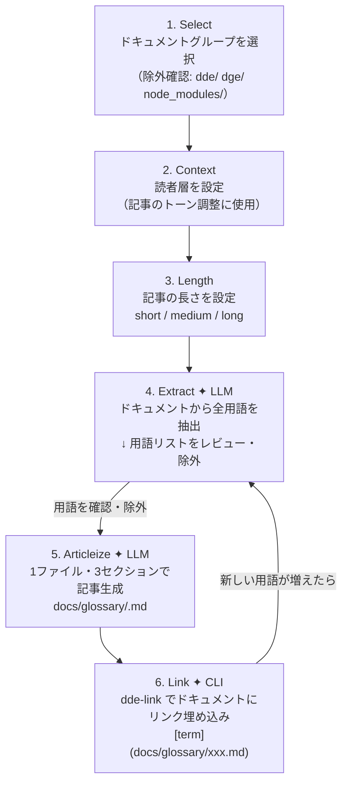
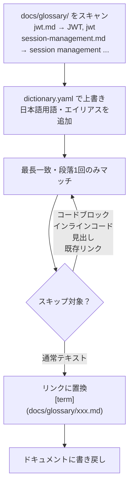
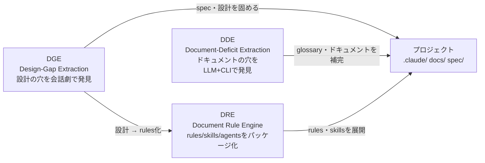

# DDE-toolkit フロー図

## 全体ワークフロー

ドキュメントの穴（用語の未定義・説明不足）を抽出し、glossary記事として自動生成・リンクするまでの流れ。

```mermaid
flowchart TD
    SELECT["1. Select\nドキュメントグループを選択\n（除外確認: dde/ dge/ node_modules/）"]
    CONTEXT["2. Context\n読者層を設定\n（記事のトーン調整に使用）"]
    LENGTH["3. Length\n記事の長さを設定\nshort / medium / long"]
    EXTRACT["4. Extract ✦ LLM\nドキュメントから全用語を抽出\n↓ 用語リストをレビュー・除外"]
    ARTICLEIZE["5. Articleize ✦ LLM\n1ファイル・3セクションで記事生成\ndocs/glossary/<term>.md"]
    LINK["6. Link ✦ CLI\ndde-link でドキュメントにリンク埋め込み\n[term](docs/glossary/xxx.md)"]

    SELECT --> CONTEXT
    CONTEXT --> LENGTH
    LENGTH --> EXTRACT
    EXTRACT -->|用語を確認・除外| ARTICLEIZE
    ARTICLEIZE --> LINK
    LINK -->|新しい用語が増えたら| EXTRACT
```

## dde-link の動作

```mermaid
flowchart TD
    SCAN["docs/glossary/ をスキャン\njwt.md → JWT, jwt\nsession-management.md → session management ..."]
    DICT["dictionary.yaml で上書き\n日本語用語・エイリアスを追加"]
    MATCH["最長一致・段落1回のみマッチ"]
    SKIP{スキップ対象？}
    REPLACE["リンクに置換\n[term](docs/glossary/xxx.md)"]
    OUT["ドキュメントに書き戻し"]

    SCAN --> DICT
    DICT --> MATCH
    MATCH --> SKIP
    SKIP -->|コードブロック\nインラインコード\n見出し\n既存リンク| MATCH
    SKIP -->|通常テキスト| REPLACE
    REPLACE --> OUT
```

## D*E シリーズの関係

```mermaid
flowchart LR
    DGE["DGE\nDesign-Gap Extraction\n設計の穴を会話劇で発見"]
    DDE["DDE\nDocument-Deficit Extraction\nドキュメントの穴をLLM+CLIで発見"]
    DRE["DRE\nDocument Rule Engine\nrules/skills/agentsをパッケージ化"]
    PROJECT["プロジェクト\n.claude/ docs/ spec/"]

    DGE -->|spec・設計を固める| PROJECT
    DDE -->|glossary・ドキュメントを補完| PROJECT
    DRE -->|rules・skillsを展開| PROJECT
    DGE -->|設計 → rules化| DRE
```
