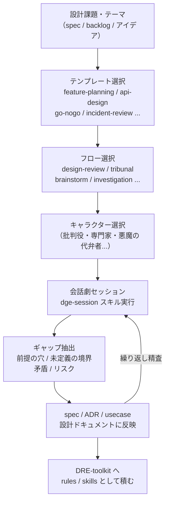
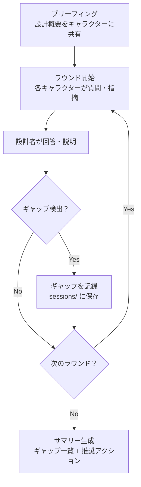
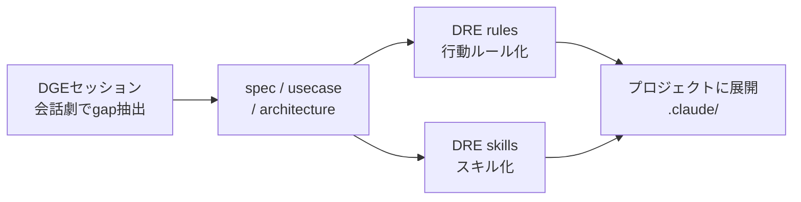

# DGE-toolkit フロー図

## 全体ワークフロー

設計課題を会話劇で掘り下げ、spec・usecase・architectureに落とすまでの流れ。

```mermaid
flowchart TD
    INPUT["設計課題・テーマ\n（spec / backlog / アイデア）"]
    TEMPLATE["テンプレート選択\nfeature-planning / api-design\ngo-nogo / incident-review ..."]
    FLOW["フロー選択\ndesign-review / tribunal\nbrainstorm / investigation ..."]
    CHARS["キャラクター選択\n（批判役・専門家・悪魔の代弁者...）"]
    SESSION["会話劇セッション\ndge-session スキル実行"]
    GAPS["ギャップ抽出\n前提の穴 / 未定義の境界\n矛盾 / リスク"]
    SPEC["spec / ADR / usecase\n設計ドキュメントに反映"]
    DRE["DRE-toolkit へ\nrules / skills として積む"]

    INPUT --> TEMPLATE
    TEMPLATE --> FLOW
    FLOW --> CHARS
    CHARS --> SESSION
    SESSION --> GAPS
    GAPS --> SPEC
    SPEC -->|繰り返し精査| SESSION
    SPEC --> DRE
```

## セッションの内部フロー

```mermaid
flowchart TD
    BRIEF["ブリーフィング\n設計概要をキャラクターに共有"]
    ROUND["ラウンド開始\n各キャラクターが質問・指摘"]
    RESPONSE["設計者が回答・説明"]
    GAP{ギャップ検出？}
    LOG["ギャップを記録\nsessions/ に保存"]
    NEXT{次のラウンド？}
    SUMMARY["サマリー生成\nギャップ一覧 + 推奨アクション"]

    BRIEF --> ROUND
    ROUND --> RESPONSE
    RESPONSE --> GAP
    GAP -->|Yes| LOG
    GAP -->|No| NEXT
    LOG --> NEXT
    NEXT -->|Yes| ROUND
    NEXT -->|No| SUMMARY
```

## DGE → DRE パイプライン

```mermaid
flowchart LR
    DGE_SESSION["DGEセッション\n会話劇でgap抽出"]
    SPEC["spec / usecase\n/ architecture"]
    DRE_RULES["DRE rules\n行動ルール化"]
    DRE_SKILLS["DRE skills\nスキル化"]
    PROJECT["プロジェクトに展開\n.claude/"]

    DGE_SESSION --> SPEC
    SPEC --> DRE_RULES
    SPEC --> DRE_SKILLS
    DRE_RULES --> PROJECT
    DRE_SKILLS --> PROJECT
```
