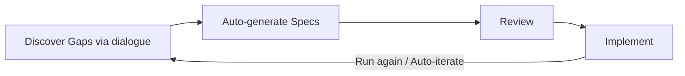

# DGE — Dialogue-driven Gap Extraction

> Discover what's missing from your design through dialogue drama.

## Quick Start

Just talk to Claude Code:

```
--- Basic ---
"Run DGE"                → ⚡ Quick. Starts a dialogue drama immediately
"DGE on <topic>"         → Topic-specified. Starts in quick mode
"Find gaps" "Spar with me" → Same as above

--- In-depth ---
"Run detailed DGE"       → 🔍 Design review. Confirms template, pattern & characters
"DGE on <topic> with Spec" → Same. Converts Gaps into Specs
"Do a thorough review"   → Same as above

--- Brainstorm ---
"Brainstorm"             → 💡 Brainstorm. Yes-and style idea divergence
"Generate ideas"         → Same as above

--- Utilities ---
"Keep iterating until implementable" → Auto-iterate (repeat until convergence)
"Add a character"        → Create a custom character
"Update DGE"             → Toolkit update guide
```

Phrasing is flexible. The appropriate mode is selected automatically based on intent.

> **Note: about auto-merge**
> By default, DGE runs a plain LLM review in the background alongside the dialogue drama and merges the results (auto-merge). This improves gap-detection accuracy but roughly doubles API token consumption. To turn it off, say "Run DGE without merge" or set `auto_merge: false` in the flow YAML.

For other LLMs, see the Quick Start (Method A) in `method.md`.

## Character Quick Reference

```
Shaky assumptions  → 👤 Columbo     "Just one more thing..."
Low quality        → 🎩 Picard      "Make it so" (only when it's worthy)
Over-complicated   → ☕ Holmes      "Boring! Eliminate the unnecessary"
Moving too fast    → 😰 Charlie Brown "Good grief... can we make this smaller?"
Not bold enough    → 👑 Steve Jobs  "Think different. Ship it."
Numbers don't add  → 🦅 Gekko      "Greed is good. Show me the numbers."
Corporate politics → 👔 Don Draper  "Let me handle the room"
Attack resilience  → 😈 Red Team    "What if a competitor does this?"
Legal risk         → ⚖ Saul        "Let's just say I know a guy"
Revenue reality    → 🦈 Gekko      "How much revenue?"
Missing impl       → ⚔ Hartman     "What is your major malfunction?"
User truth         → 🎰 Durden     "You are not your framework"
Hidden problems    → 🏥 House      "Everybody lies"
Not understood     → 🧑‍🏫 Mr. Rogers "Let's think about this together"
Bad UX             → 🎨 Jony Ive   "Does it feel inevitable?"
No measurement     → 📊 Beane      "What does the data say?"
Chaos in discussion→ 🤝 Kouhai     "Let's be constructive"
Too complex        → 🪄 Tyson      "Imagine you're..."
Small contradiction→ 🕵 Monk       "Something's not right here"
Fixed thinking     → 🎭 Socrates   "Why do you think so? What if the opposite?"
+ Custom 🎭 "Add Guts" to permanently add any character you like
```

## Patterns (Presets)

| Preset | Use Case |
|---|---|
| 🆕 new-project | New project |
| 🔧 feature-extension | Feature addition |
| 🚀 pre-release | Pre-release check |
| 📢 advocacy | Internal proposal |
| 🔍 comprehensive | Comprehensive DGE |

See [patterns.md](./patterns.md) for details.

## DGE Flow



## Folder Structure

```
kit/
├── README.md              ← Main README (Japanese)
├── README.en.md           ← This file (English)
├── LICENSE
├── method.md              ← Methodology
├── patterns.md            ← 20 patterns + 5 presets
├── integration-guide.md   ← Integration guide for existing workflows
├── dialogue-techniques.md ← Dialogue techniques
├── CUSTOMIZING.md         ← Customization guide
├── INTERNALS.md           ← Internal architecture
├── characters/
│   ├── catalog.md         ← Character catalog (Japanese)
│   ├── index.md           ← Character index (Japanese)
│   ├── index.en.md        ← Character index (English)
│   ├── en/                ← 19 English characters
│   │   ├── columbo.md
│   │   ├── picard.md
│   │   ├── holmes.md
│   │   ├── charlie-brown.md
│   │   ├── steve-jobs.md
│   │   └── ...
│   └── *.md               ← Japanese characters
├── flows/
│   ├── quick.yaml         ← Quick mode flow
│   ├── design-review.yaml ← Design review flow
│   └── brainstorm.yaml    ← Brainstorm flow
├── bin/
│   └── dge-tool.js        ← CLI tool
├── skills/
│   ├── dge-session.md     ← Session skill
│   ├── dge-character-create.md ← Character creation skill
│   └── dge-update.md      ← Update skill
├── templates/             ← Topic-specific templates
│   ├── api-design.md
│   ├── feature-planning.md
│   ├── go-nogo.md
│   ├── incident-review.md
│   └── security-review.md
├── test/
│   └── dge-tool.test.js   ← Tests
├── install.sh             ← Installer
├── update.sh              ← Updater
├── package.json
└── version.txt
```

## License

MIT License. See [LICENSE](./LICENSE) for details.

More info: https://github.com/xxx/DGE-toolkit
