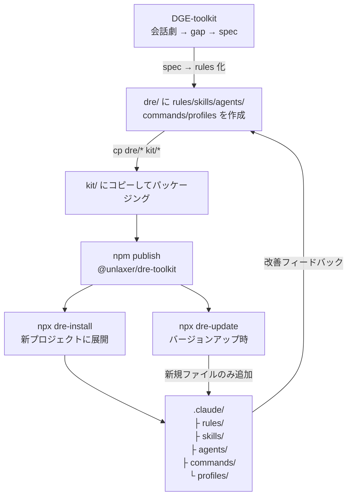
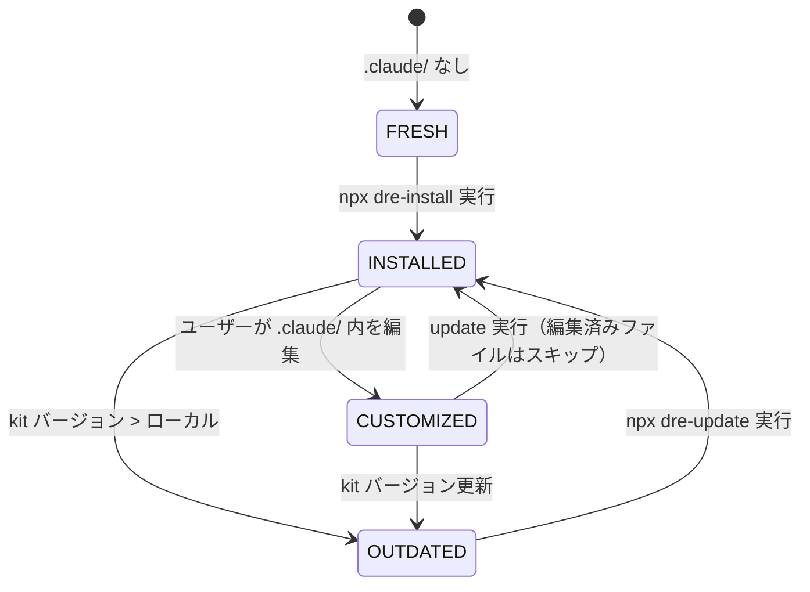
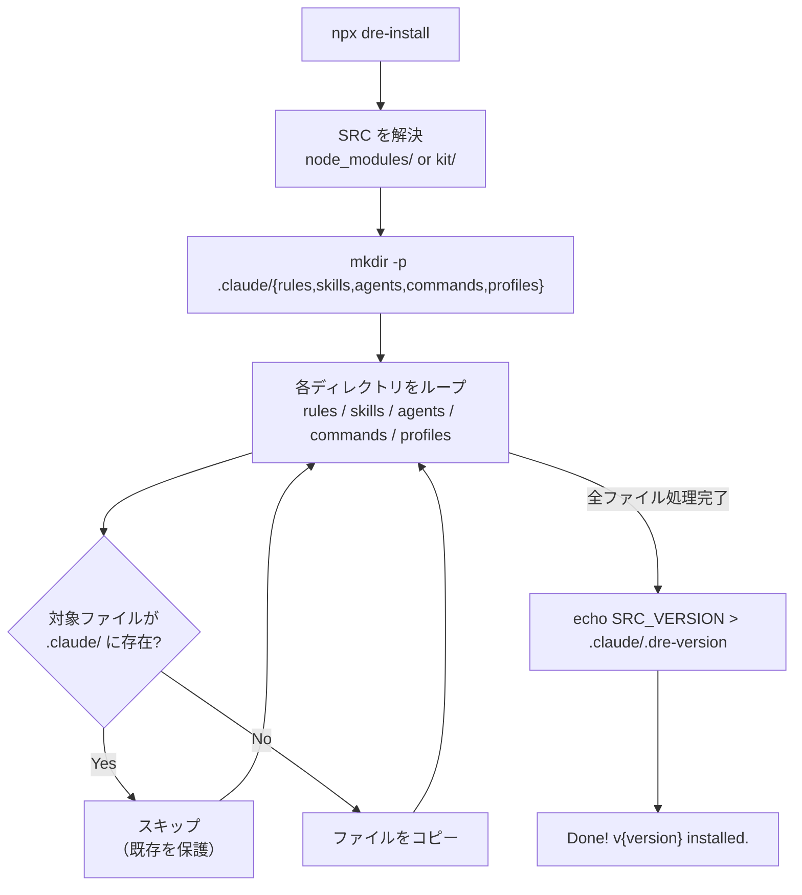
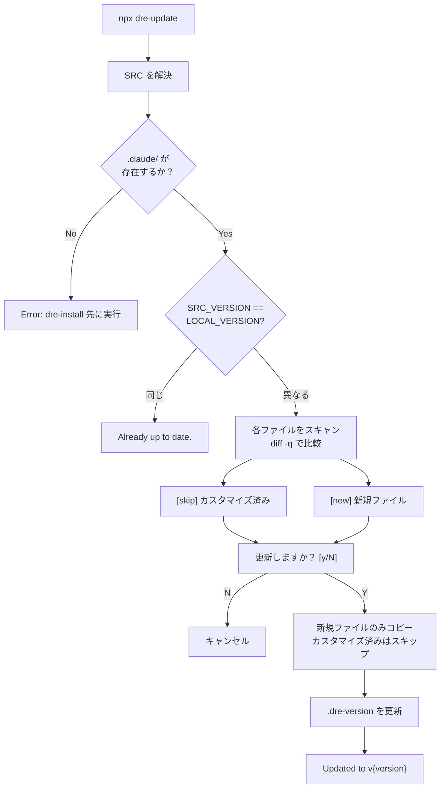
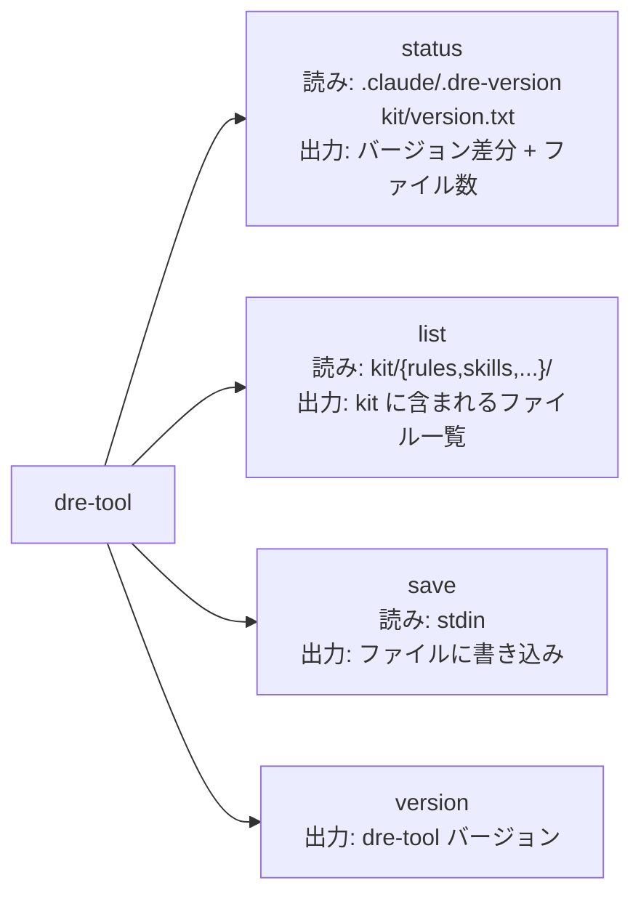
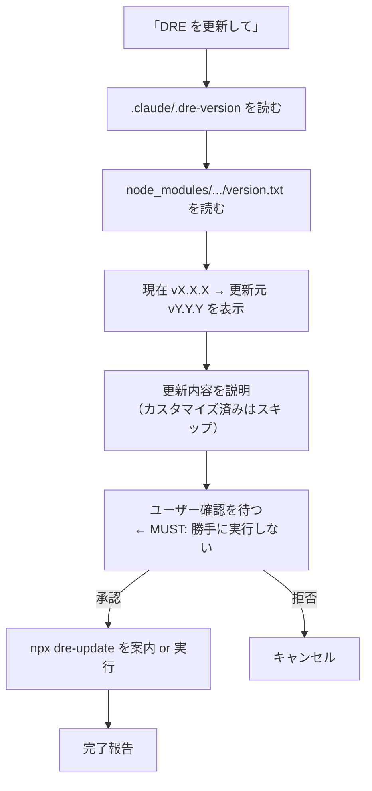
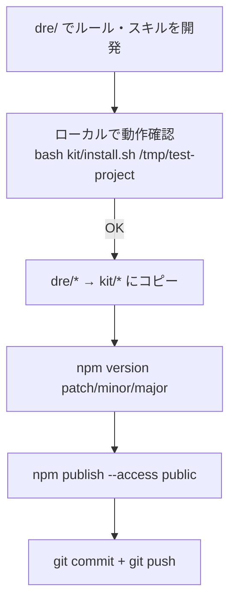
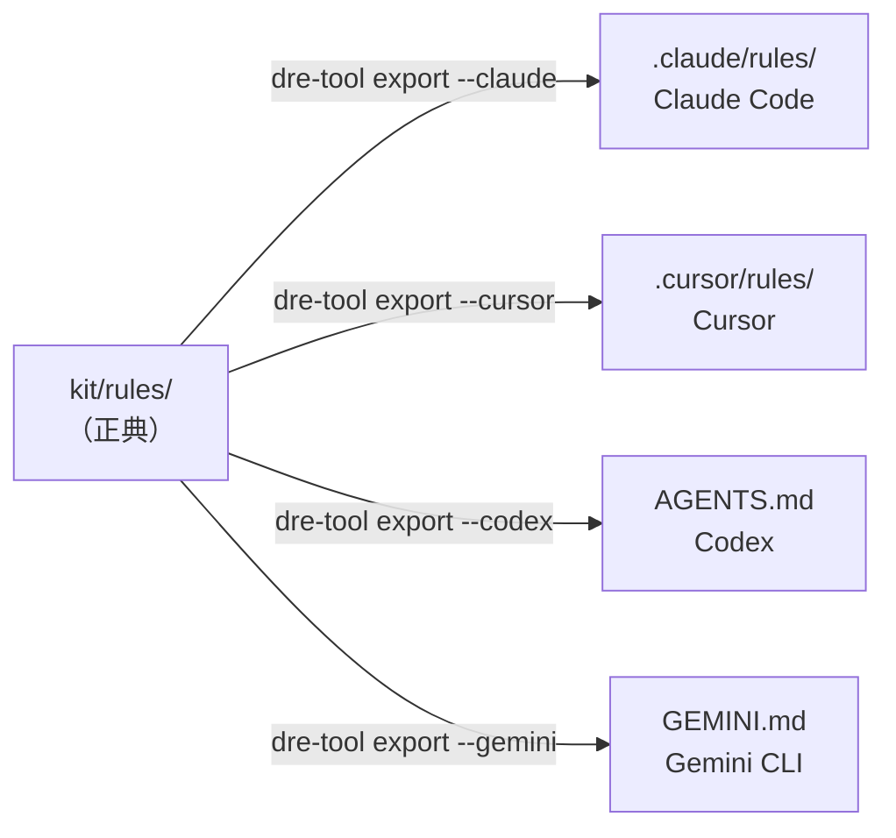

# DRE-toolkit フロー図

> 現状 v0.1.0 の実装を反映。未実装・将来機能は明示。

---

## 1. 全体ワークフロー

DGE で設計 → DRE で rules 化 → npm 配布 → プロジェクト展開。

---

## 2. インストール状態の遷移

`.claude/.dre-version` の有無とバージョン差分で状態が決まる。

| ステート | 条件 | `.dre-version` |
|---------|------|---------------|
| FRESH | `.claude/` が存在しない | なし |
| INSTALLED | インストール済み・最新 | kit と一致 |
| OUTDATED | kit のバージョンが新しい | kit より古い |
| CUSTOMIZED | ユーザーがファイルを編集済み | 一致するが diff あり |

---

## 3. install.sh の詳細フロー

**トリガー**: `npx dre-install [target_dir]`

**読み込み**:
- `kit/version.txt` — 配布バージョン
- `kit/rules/*.md`, `kit/skills/*.md`, `kit/agents/*.md`, `kit/commands/*.md`, `kit/profiles/*.md`

**書き出し**:
- `.claude/rules/`, `.claude/skills/`, `.claude/agents/`, `.claude/commands/`, `.claude/profiles/`
- `.claude/.dre-version` — バージョン記録

**ルール**:
- `.gitkeep` はコピーしない
- 既存ファイルは上書きしない（初回インストール保護）
- 失敗しても残ったファイルは保持される（set -euo pipefail）

---

## 4. update.sh の詳細フロー

**トリガー**: `npx dre-update [target_dir]`

**読み込み**:
- `kit/version.txt` — 配布バージョン
- `.claude/.dre-version` — ローカルバージョン
- 各 kit ファイルと `.claude/` 対応ファイルの diff

**書き出し**:
- 新規ファイルのみ `.claude/` に追加
- `.claude/.dre-version` を更新

**ルール**:
- バージョンが同じなら何もしない
- `diff -q` で差異があるファイル（＝カスタマイズ済み）はスキップ
- `.claude/` に存在しない新規ファイルのみ追加
- 実行前にユーザー確認必須（`read -p`）
- `--force` フラグ: **未実装**（将来: カスタマイズ済みも強制上書き）

---

## 5. dre-tool CLI のフロー

**トリガー**: `dre-tool <command>`

**未実装コマンド**（将来）:
- `dre-tool export --cursor` — `.cursor/rules/` に変換出力
- `dre-tool export --codex` — `AGENTS.md` に DRE セクションを出力
- `dre-tool export --gemini` — `GEMINI.md` に出力

---

## 6. dre-update スキル（Claude Code 内）

**トリガー**: 「DRE を更新して」「dre update」「ルールを更新して」

**読み込み**:
- `.claude/.dre-version`
- `node_modules/@unlaxer/dre-toolkit/version.txt`

**出力**（Claude が生成）:
- バージョン比較表示
- 更新対象ファイル一覧
- ユーザー確認 → `npx dre-update` 実行案内

**MUST ルール**:
1. 更新前に必ずユーザーの確認を得る
2. カスタマイズ済みファイルには触らない
3. npm が見つからない場合は手順を案内する

---

## 7. DRE 開発フロー（メンテナー向け）

rules/skills を追加・更新して publish するまでの流れ。

**バージョニングルール**:

| 変更内容 | バージョン |
|---------|-----------|
| typo 修正、文言微調整 | patch |
| rules/skills ファイル追加 | minor |
| install.sh / update.sh の動作追加 | minor |
| ファイルパス変更、構造変更 | **major** |
| install.sh / update.sh の MUST ルール変更 | **major** |

---

## 8. クロスツール変換（将来・未実装）

DRE rules を正典として他ツール形式に変換する。

---

## 9. 現状サマリー（v0.1.0）

| コンポーネント | 状態 | 備考 |
|-------------|------|------|
| install.sh | ✅ 実装済み | 基本動作 OK |
| update.sh | ✅ 実装済み | --force 未実装 |
| dre-tool.js | ✅ 実装済み | export 系は未実装 |
| skills/dre-update.md | ✅ 実装済み | ja/en |
| kit/rules/ | ⬜ 空 | v0.3.0 で AskOS から収録予定 |
| kit/skills/ | ⬜ dre-update.md のみ | |
| kit/agents/ | ⬜ 空 | |
| kit/commands/ | ⬜ 空 | |
| kit/profiles/ | ⬜ 空 | |
| extends 継承機構 | ❌ 未設計 | v0.2.0 課題 |
| クロスツール変換 | ❌ 未実装 | 将来機能 |
