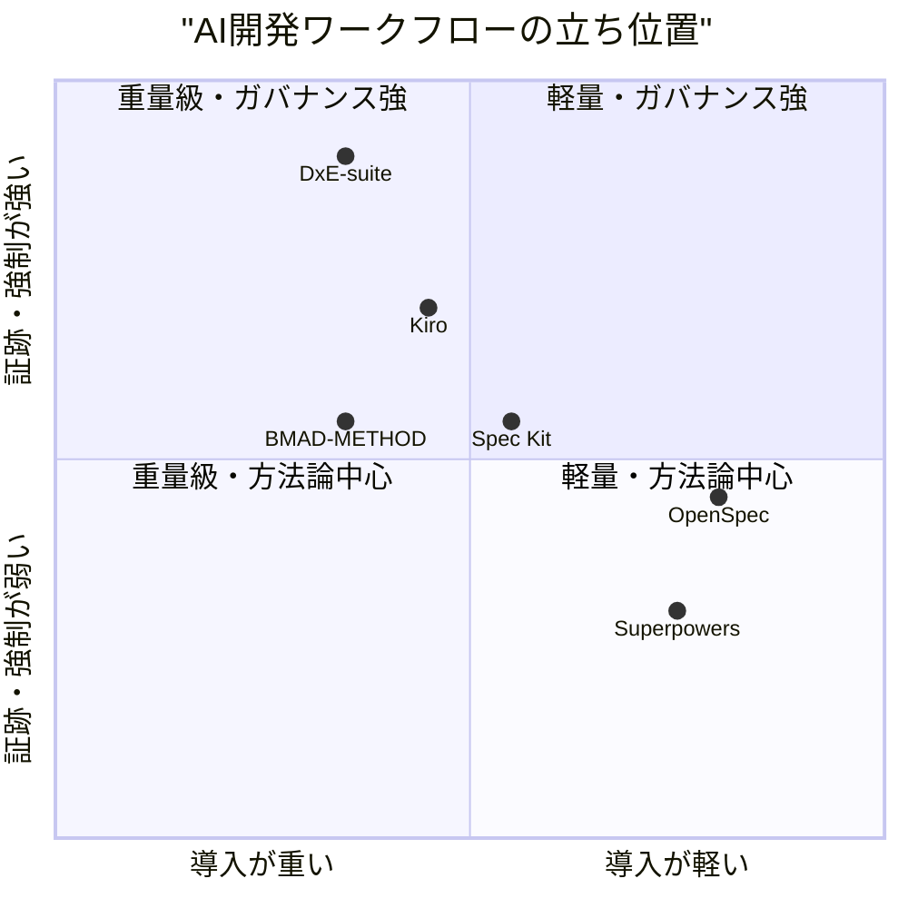
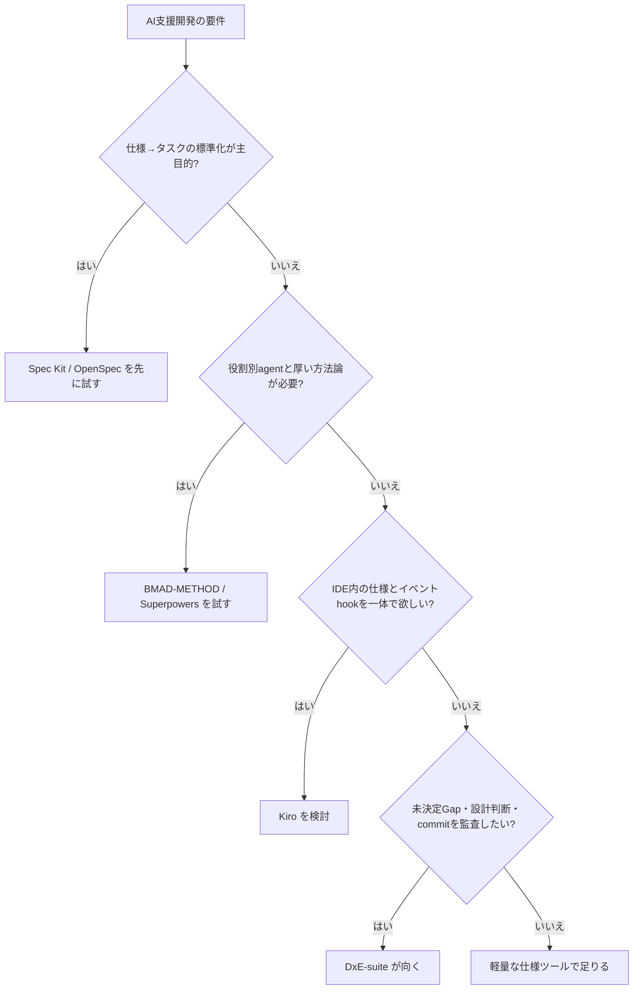

# 0. 要約

立ち位置: DxE-suiteは、AI開発の仕様作成そのものより「対話→Gap→設計判断→仕様→実装→文書」の証跡をGitに残し、未決定を可視化し、フックで運用を強制する統合基盤である。

最大の弱点: Spec Kit、OpenSpec、BMAD-METHOD、Superpowersが数万〜26万starsで先行する一方、DxE-suiteはClaude Code中心で、導入後に得られる効果を示す公開採用指標が確認できない。

次の一手: 機能を増やす前に、5分で試せる最小導入と「未決定Gapが減った」「DD参照付きcommitになった」という効果計測を公開し、決定ガバナンスのカテゴリを取りに行く。

# 1. このrepoは何か

DxE-suiteは、DGE（設計Gap抽出）、DDE（文書Gap抽出・用語リンク）、DVE（決定グラフ可視化）、DRE（ルール・skills・hooksの配布とワークフロー強制）を一つのCLI/npm monorepoに束ねる統合スイートである。READMEだけでなく `docs/architecture.md` と実装を確認した。

提供価値は、AIとの会話や人の判断を一時的なチャットで終わらせず、`Session → Gap → DD → Spec` として追跡可能にすること、未解決GapをDVEで見つけること、DREのPostToolUse・Stop・commit-msgフックで記録漏れを止めることである。利用者はClaude Codeを使う個人開発者・チームで、前段にLLM/人の対話、後段にGit・CI・レビューがいる。したがって比較単位は個別のMarkdownライブラリではなく、AI支援開発の計画・証跡・強制をまとめて置き換えるツール群とした。

確認できた客観指標は、root package version 4.2.0、公開URL（[GitHub](https://github.com/opaopa6969/DxE-suite)）、DGEのcharacters 26ファイル、DGE flows 8本、`.claude/skills` 21ファイル、対象コード等約19,923行である。実行テストはDRE 17 pass、DVE 1 pass。DGEはサブプロセス実行がsandboxで `EPERM` となり3 pass/17 fail、DDEはこの環境で `vitest` が解決できず未実行だった。これは現時点の実行確認であり、品質の総合評価ではない。

このrepoは「四つの独立した部品を束ねただけ」ではない。各部品は単体でも使えるが、DGEのセッション形式、DD参照、DVEの読み取り、DREの強制が相互契約でつながるため、全体としての価値は統合運用にある。

# 1.5 調査の型

`target_type: aggregate` とした。単体評価できるDGE/DDE/DVE/DREには近い代替機能を割り当て、suite integrationは単体比較しない。全体比較の軸は、AIエージェント対応、意図・仕様の構造化、設計対話、決定の追跡、未決定の可視化、運用強制、文書整備、導入負荷である。

# 1.8 構成と評価単位

| 部品 | 何か | 単体で評価できるか | 理由 | 比較対象 |
|---|---|---|---|---|
| DGE | キャラクター対話で設計Gapを抽出 | できる | 入力とGap/session出力が閉じている | Spec Kit, OpenSpec, BMAD, Superpowers |
| DDE | 用語抽出・記事化・Markdown自動リンク | できる | Markdownを入力しglossaryを出力する | Spec Kit, OpenSpec |
| DVE | Session/DD/Specの決定グラフ・未決定Gap可視化 | できる | graph.jsonとUI/APIを持つ | Spec Kit, Kiro |
| DRE | hooks・rules・skills・状態機械の配布/強制 | できる | CLIとhookが独立して導入できる | Kiro, Spec Kit |
| suite integration | 四部品の契約と統合CLI | できない | 上記部品が揃って初めて意味が出る | 仕様・エージェント開発スイート全体 |

この分類から、DGEの会話手法だけをBMADと競わせたり、DVEだけをグラフUI製品と競わせたりすると、DxE-suiteの本当の価値を過小評価する。逆に、統合契約は競合表の一行で○にしてはならない。

# 2. 比較対象と選定理由

| 製品 | 何ができるか | 採用状況（2026-07-31参照） | ライセンス | うちとの決定的な違い | なぜ比較対象に選んだか |
|---|---|---:|---|---|---|
| GitHub Spec Kit | 仕様→計画→タスク→実装、拡張・preset・bundle、30+エージェント連携 | 106k+ stars、v0.15.0を7/30リリース | MIT | 仕様駆動の標準化と拡張エコシステムが強い。設計対話の全文証跡・Gapグラフ・commit強制は主目的ではない | 最大規模で、DxEが「仕様ツール」と誤認された場合の直接比較対象 |
| Fission-AI OpenSpec | proposal/spec/design/tasksを変更単位で管理し、30+ AI assistantに導入 | 63.2k stars、npm v1.6.0、活発なrelease | MIT | 軽量で反復的。DxEのような複数artifact横断の決定グラフとhook強制は主目的ではない | 同じOSS/CLI/Claude Code文脈で、導入の軽さを競う相手 |
| BMAD-METHOD | 役割別agentと34+ workflowでアイデアから実装まで進める | 51.3k stars、5/26時点で更新確認 | MIT（商標規約あり） | 人格・役割と工程の厚みが強い。DGEのGap抽出に近いが、DVEの決定履歴・DREのcommit enforcementとは設計焦点が異なる | 対話型・役割型の開発方法論として最も近い |
| obra Superpowers | composable skillsとagent向け開発方法論、複数agent対応 | 263.9k stars、最終push 7/28 | MIT | agentの実行品質と技能に集中し、構造化されたDD/Gap/decision graphは持たない | stars最大の実務導入競合。DxEのDGE/DREを部分置換し得る |
| Kiro | IDE/CLI/Webでrequirements→design→tasks、steering、event-driven hooks | starsは非該当（商用サービス） | 公開OSSライセンスなし | 仕様とフックを一体化した完成サービスだが、IDE/ベンダー環境への依存がある。DxEはGit/Markdown中心で可搬 | DxEの仕様＋hook統合をサービスとして最も近く実装しているため |

市場は「AIにコードを書かせる前の仕様化」に急速に標準が集まり、Spec Kit/OpenSpec/BMAD/SuperpowersのようなOSS方法論が乱立している。一方、設計判断の後から「何を決め、何が未決定で、commitがどの判断に紐づくか」を監査する層は比較的空いている、と読める。Kiroが示すように、仕様と自動フックは今後一体化しやすく、DxEはこの軸で明確な名前と証拠を持たないと埋もれる。

# 3. ポジショニング

位置は機能の存在から相対的に置いたもので、導入時間や監査効果の実測値が揃っていないため、厳密なベンチマークではない（推測）。

# 4. 機能比較

| 機能 | 重み | DxE-suite | Spec Kit | OpenSpec | BMAD | Superpowers | Kiro |
|---|---|---|---|---|---|---|---|
| AIエージェントへ導入 | ◎必須 | △ Claude Code中心 | ○ 30+ | ○ 30+ | ○ 複数 | ○ 複数 | △ 自社環境中心 |
| 意図→仕様→タスク | ◎必須 | ○ DGE/DD/spec + DRE | ○ | ○ | ○ | △ | ○ |
| 設計上の前提・Gapを対話で攻める | ◎必須 | ○ キャラクター/flow | △ clarify等 | △ explore | ○ agent/workflow | ○ brainstorming | △ agent対話 |
| 判断・仕様・セッションの横断追跡 | ◎必須 | ○ DVE graph | △ artifact単位 | △ change/spec単位 | △ workflow単位 | × | △ spec単位 |
| 未決定Gapの一覧・再開コンテキスト | ◎必須 | ○ orphan Gap/context | △ | △ | △ | × | × |
| ルール・hookによる強制 | ◎必須 | ○ PostToolUse/Stop/commit-msg | △ extension/preset | △ integration依存 | △ workflow依存 | △ skill指示 | ○ event hook |
| 文書用語の抽出・自動リンク | ○効く | ○ DDE | × | × | △ | × | △ |
| Git/Markdown中心の可搬性 | ○効く | ○ | ○ | ○ | ○ | ○ | × IDE依存 |
| 導入の軽さ | ○効く | △ 4 toolkit + hook + UI | △ Python/uv | ○ npm init | △ modules/workflows | ○ skill install | △ IDE/CLI |
| 公開採用・コミュニティの大きさ | △あれば | × 数値未確認 | ○ | ○ | ○ | ○ | ○ 商用認知 |

痛い×は「AIエージェント非依存」と「公開採用の証拠」である。ユーザーがすでにClaude Codeを使い、決定の監査が必要ならDxEの○は強いが、導入時点でエージェントを選べないと比較の入口に立てない。逆に、仕様→タスク→実装は他社も○で、単独の差別化にはならない。DDEの自動リンクも便利だが、主戦場を決める決定打ではない。

# 5. 採用状況

全OSS比較対象のstarsは取得できたが、Kiroは商用サービスでstarsがなく、DxE-suiteについてもこの調査環境から同じ数値を確認できなかった。そのため、書式の条件に従い採用状況の棒グラフは描かない。starは導入者数ではなく関心の近似値であり、特にDxEの価値を否定する証拠にはならない。

# 5.5 調査者の見立て

本当の勝負所は、DGEの「面白い対話」ではなく、対話で出たGapがDD・spec・commit・再開コンテキストまで切れずにつながることだと思う。競合は仕様を作るところまで強いが、未決定を一次成果物として扱い、後工程の記録を止める設計は明確ではない。

数字に出ていない懸念は、DxEが四つの名前と多数の概念を先に学習させる点である。README上は価値が豊富だが、最初の成功体験までの距離が遠い。DGEのテストが環境制約で17件中17件のサブプロセス系を実行できず、DDEのテストも依存解決できなかったことは、導入の信頼性を測る公開証拠がまだ薄いことを示す。

私なら、次のリリースでは機能追加を止め、`dxe init`→1回のGap抽出→1つのDD→1回の検証という一本道を作り、導入時間・記録漏れ率・未決定Gapの解消率を計測して公開する。そこで決定ガバナンスの実効性が見えれば、Spec Kit/OpenSpecと競合するのではなく併用される位置を取れる。

この見立てが外れるのは、ユーザーが「監査」より「その場でコードを出す速度」を選び、Spec KitやSuperpowersで十分だと判断する場合である。また、Spec Kitが決定グラフ・品質ゲート・commit追跡を標準機能として取り込めば、DxEの差別化は縮む。反対に競合がその層を実装しない限り、差別化は残る。

# 6. 提案（優先順）

| 順 | 提案 | 分類 | 根拠 | 最小の一手 | 効きそうな指標 |
|---:|---|---|---|---|---|
| 1 | `dxe init`の一本道導入とサンプルrepoを作る | 埋める | 導入負荷が△、公開採用の証拠が× | 1コマンドでDGE→DD→DVEまで動くfixtureを追加し、計測用READMEを公開 | 初回成功までの分数、離脱率 |
| 2 | 決定トレーサビリティを「監査可能な一枚」にする | 伸ばす | DD/Gap/session/spec/commit追跡が決定的差分 | `dve audit`で orphan Gap、DD未参照commit、欠落sessionをJSON/Markdown出力 | orphan率、commitのDD参照率 |
| 3 | Claude Code以外を最小限のadapterで増やす | 埋める | AIエージェント対応が△で入口を狭めている | OpenAI Codex CLI、Cursor、GitHub Copilot CLIのうち2つへskills/commandsを配布 | 対応agent数、各agentの導入成功率 |
| 4 | 公開fixtureで導入前後の効果を測る | 伸ばす | 数字に出る採用・効果が不足 | 同一課題でGap数、DD記録率、再開時間を記録し、競合との機能表を再現可能にする | Gap発見数、未決定解消時間、再作業率 |
| 5 | 四 toolkitをさらに増やす／DDEの自動リンクを主差別化にする | やらない | ○だが競合の主戦場ではなく、導入概念を増やす | 追加機能ではなく既存契約とテスト安定化に投資 | 導入時間を増やさないこと、テスト成功率 |

優先順は「新機能の多さ」ではなく、独自価値を初回体験でき、証明できる順である。5番をやらないことで、DxEを総合AI開発フレームワークへ拡張してBMAD/Superpowersと正面衝突する車輪の再発明を避ける。

# 7. 選択の分岐

自分を選ばない条件は、設計判断の証跡を残す必要がない、Claude Code中心の導入を許容できない、またはIDE一体型の体験を最優先する場合である。逆に「未決定を放置したくない」「後から判断の根拠を追いたい」「Git上のMarkdownを正としたい」が同時にある場合にDxEを選ぶ理由が生まれる。

# 8. 出典

| URL | 参照日 | 何の根拠に使ったか |
|---|---|---|
| [DxE-suite README](https://github.com/opaopa6969/DxE-suite/blob/main/README.md) | 2026-07-31 | suiteの目的、四 toolkit、CLI、機能、version |
| [DxE-suite architecture](https://github.com/opaopa6969/DxE-suite/blob/main/docs/architecture.md) | 2026-07-31 | 比較単位、部品間契約、責務境界 |
| [GitHub Spec Kit](https://github.com/github/spec-kit) | 2026-07-31 | 機能、MIT、106k+ stars、30+ agent対応 |
| [Spec Kit releases](https://github.com/github/spec-kit/releases) | 2026-07-31 | v0.15.0の7/30リリース、拡張・hook・presetの更新 |
| [Fission-AI OpenSpec](https://github.com/Fission-AI/OpenSpec) | 2026-07-31 | 機能、MIT、63.2k stars、30+ assistant対応 |
| [OpenSpec package metadata](https://github.com/Fission-AI/OpenSpec/blob/main/package.json) | 2026-07-31 | npm v1.6.0、MIT、Node/CLI実装 |
| [BMAD-METHOD](https://github.com/bmad-code-org/BMAD-METHOD) | 2026-07-31 | 34+ workflow、agent/module、MIT、51.3k stars |
| [BMad Code organization](https://github.com/bmad-code-org) | 2026-07-31 | 2026-05-26時点の更新表示、starsの補助確認 |
| [obra Superpowers](https://github.com/obra/superpowers) | 2026-07-31 | composable skills、複数agent、MIT、263.9k stars |
| [Superpowers GitHub API repository metadata](https://api.github.com/repos/obra/superpowers) | 2026-07-31 | pushed_at 2026-07-28、stars、license、repo size |
| [Kiro](https://kiro.dev/) | 2026-07-31 | IDE/CLI/Web、spec-driven development、hooks、steering |
| [Kiro Specs documentation](https://kiro.dev/docs/specs/) | 2026-07-31 | requirements/design/tasksの三段階、task実行と並列化 |
| [DxE-suite local package.json](https://github.com/opaopa6969/DxE-suite/blob/main/package.json) | 2026-07-31 | version 4.2.0、MIT、workspace、CLI |

比較対象のコード自体はaggregateの全体比較が主眼のため、libraryのAPI数比較は行わなかった。DxE-suiteのローカルコード・manifest・テストは実際に読み、ローカルテストも実行した。比較対象については公開repository・公式ドキュメント・公開release/metadataを確認したが、各競合をローカルcheckoutしてテストするまでは行っていないため、confidenceは「中」とした。
