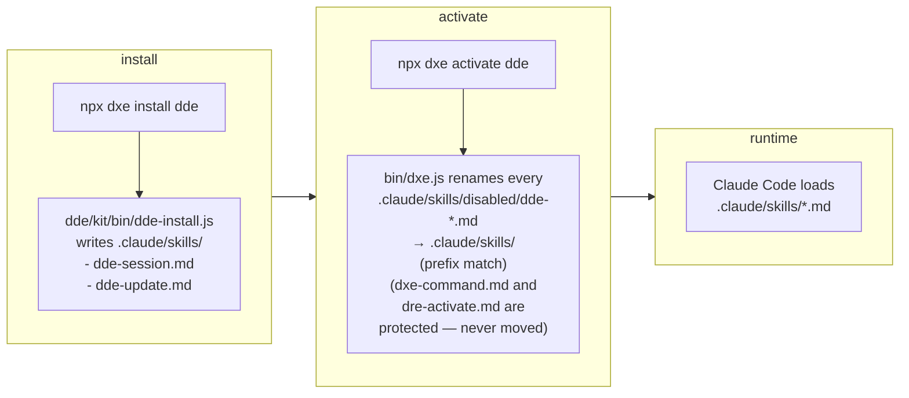

# Skill activation flow — `disabled/` × `dxe activate`

DxE-suite installs every skill **disabled by default**. This document explains why, and how the `.claude/skills/disabled/` convention interacts with `dxe activate`.

## Why disabled-by-default

Installing a toolkit writes its skill files into `.claude/skills/`. Claude Code loads every `*.md` file there, so a fresh install would light up 20+ skills at once — too noisy for projects that only want one or two.

DRE's convention: an install puts skills under `.claude/skills/disabled/` (Claude Code ignores that subdirectory). `dxe activate` moves the files you want into `.claude/skills/`.

## The flow



> **Note on current DDE behavior**: `dde-install` today writes `dde-session.md` / `dde-update.md` directly into `.claude/skills/` (not `disabled/`). DGE / DRE / DVE install scripts put skills into `disabled/`. Until DDE is aligned, the first `dxe activate dde` after a DDE install may be a no-op (the skills are already active). This is noted under [§4.3 Relationship to DRE skill control](../dde/MIGRATION.md#dde-install-merge-behavior-current-limitation).

## Prefix rules

`bin/dxe.js` decides which files belong to which toolkit by filename prefix:

| Toolkit | Prefixes |
|---|---|
| `dge` | `dge-` |
| `dde` | `dde-` |
| `dre` | `dre-`, `dxe-`, `architect-`, `backlog-`, `doc-to-`, `phase`, `release`, `spec-`, `story-`, `test` |
| `dve` | `dve-` |
| `all` | (everything under `disabled/`) |

Protected skills (never moved by `deactivate`): `dxe-command.md`, `dre-activate.md`.

## Commands

```bash
npx dxe activate all         # enable every disabled skill
npx dxe activate dge         # enable DGE skills only
npx dxe activate dde         # enable dde-session, dde-update
npx dxe deactivate dve       # push DVE skills back to disabled/
```

The `activate` / `deactivate` commands are idempotent — re-running does nothing if the target state already holds.

## Where the policy is declared

- Enforcement script: [`bin/dxe.js`](../bin/dxe.js) (`activate` / `deactivate` commands).
- Agent-visible rule: [`.claude/rules/dre-skill-control.md`](../.claude/rules/dre-skill-control.md) — tells coding agents that files under `.claude/skills/disabled/` are inactive and should not be followed.
- Protected-skills list: hard-coded constant `PROTECTED` in `bin/dxe.js`.

## Related docs

- [README.md § The `dxe` CLI](../README.md#the-dxe-cli)
- [dde/MIGRATION.md](../dde/MIGRATION.md)
- [ADR-0002 — Archive DDE into the monorepo](decisions/0002-archive-dde-into-monorepo.md)
