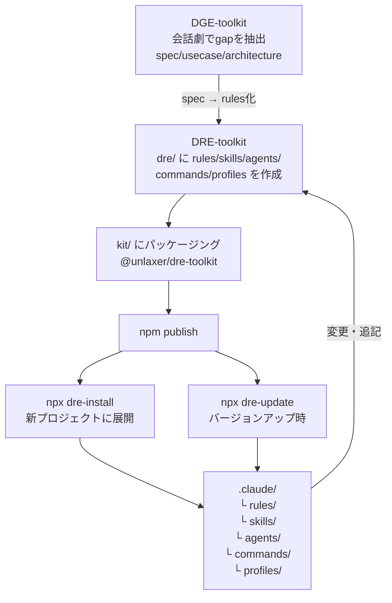
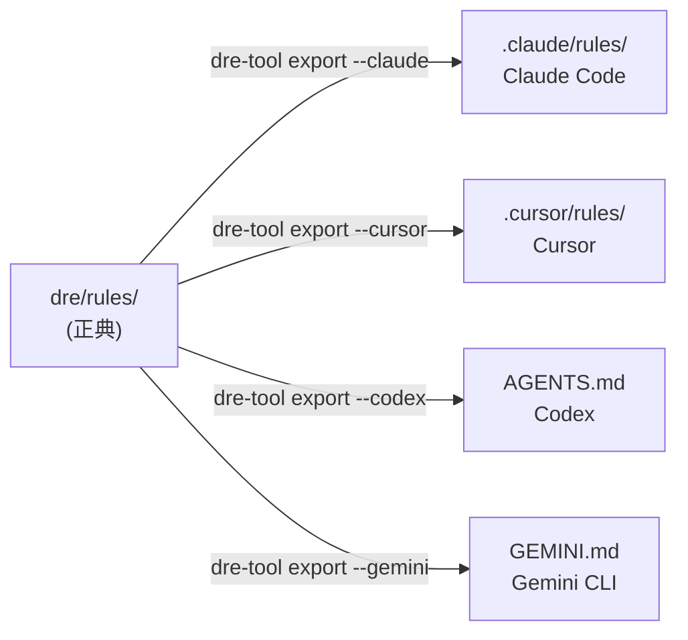
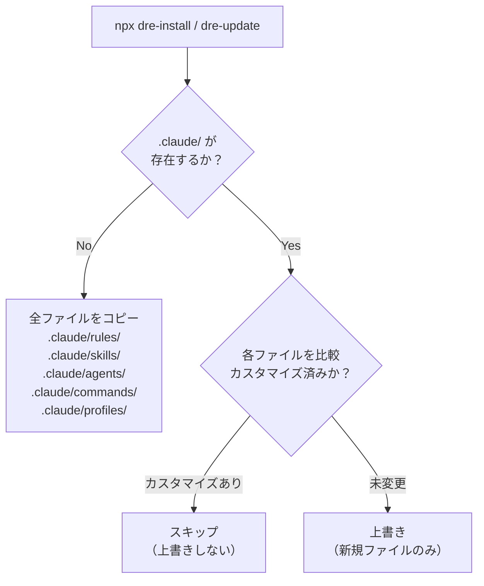

# DRE-toolkit フロー図

## 全体ワークフロー

DGE で設計した仕様を DRE で rules 化し、プロジェクトに展開するまでの流れ。

```mermaid
flowchart TD
    DGE["DGE-toolkit\n会話劇でgapを抽出\nspec/usecase/architecture"]
    DRE_DEV["DRE-toolkit\ndre/ に rules/skills/agents/\ncommands/profiles を作成"]
    KIT["kit/ にパッケージング\n@unlaxer/dre-toolkit"]
    NPM["npm publish"]
    INSTALL["npx dre-install\n新プロジェクトに展開"]
    PROJECT[".claude/\n└ rules/\n└ skills/\n└ agents/\n└ commands/\n└ profiles/"]
    UPDATE["npx dre-update\nバージョンアップ時"]

    DGE -->|spec → rules化| DRE_DEV
    DRE_DEV --> KIT
    KIT --> NPM
    NPM --> INSTALL
    INSTALL --> PROJECT
    PROJECT -->|変更・追記| DRE_DEV
    NPM --> UPDATE
    UPDATE --> PROJECT
```

## rules → 各ツール変換（将来）

DRE の rules を正典として他ツール形式に変換する。

```mermaid
flowchart LR
    RULES["dre/rules/\n(正典)"]
    CLAUDE[".claude/rules/\nClaude Code"]
    CURSOR[".cursor/rules/\nCursor"]
    CODEX["AGENTS.md\nCodex"]
    GEMINI["GEMINI.md\nGemini CLI"]

    RULES -->|dre-tool export --claude| CLAUDE
    RULES -->|dre-tool export --cursor| CURSOR
    RULES -->|dre-tool export --codex| CODEX
    RULES -->|dre-tool export --gemini| GEMINI
```

## install/update の動作

```mermaid
flowchart TD
    START["npx dre-install / dre-update"]
    CHECK{".claude/ が\n存在するか？"}
    FRESH["全ファイルをコピー\n.claude/rules/\n.claude/skills/\n.claude/agents/\n.claude/commands/\n.claude/profiles/"]
    MERGE{"各ファイルを比較\nカスタマイズ済みか？"}
    SKIP["スキップ\n（上書きしない）"]
    OVERWRITE["上書き\n（新規ファイルのみ）"]

    START --> CHECK
    CHECK -->|No| FRESH
    CHECK -->|Yes| MERGE
    MERGE -->|カスタマイズあり| SKIP
    MERGE -->|未変更| OVERWRITE
```
