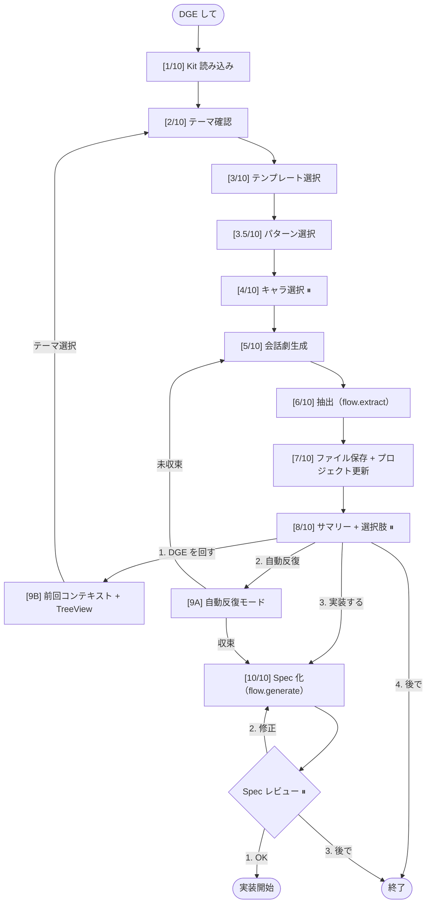
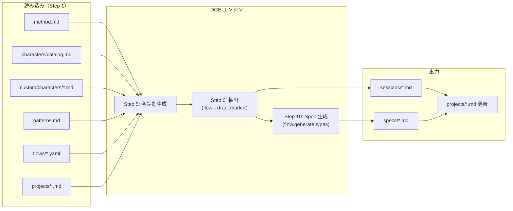
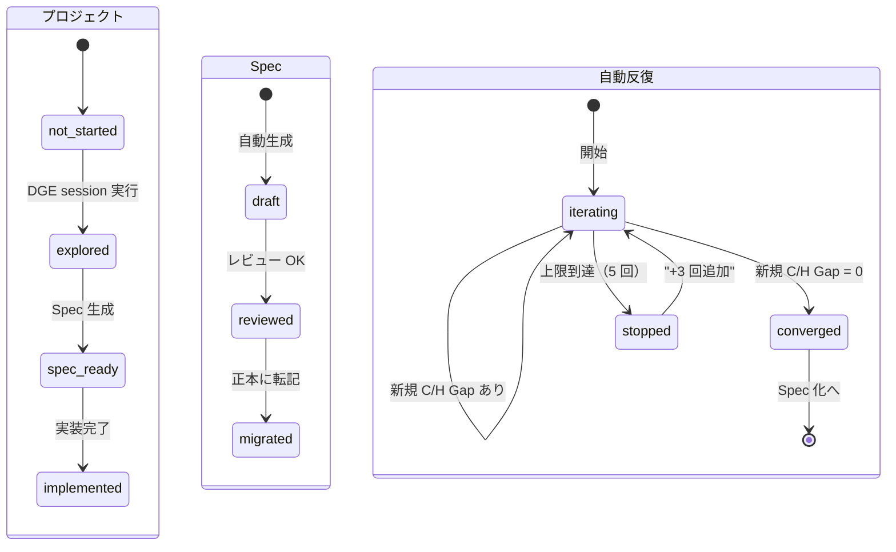

# DGE Internals — 内部構造

DGE toolkit の内部構造。カスタマイズする際の参考に。

## フロー図

⏸ = ユーザーの応答を待つポイント

## データフロー図

## ステート図

## Hook ポイント一覧

各 Step でカスタマイズ可能なポイント。Level 1 は YAML / ファイル追加で変更可能。Level 2 は skill 編集（fork 推奨）。

| Step | 名前 | Hook | Level |
|------|------|------|-------|
| 1 | Kit 読み込み | 読み込むファイル一覧 | 2 |
| 2 | テーマ確認 | テーマの掘り下げロジック | 2 |
| 3 | テンプレート選択 | テンプレートの追加 | 1（templates/ にファイル追加） |
| 3.5 | パターン選択 | プリセットの追加・推奨マッピング | 1（patterns.md 編集） |
| 4 | キャラ選択 | キャラの追加・推奨ロジック | 1（custom/characters/）/ 2（推奨ロジック） |
| 5 | 会話劇生成 | ナレーション構造・Scene 構成 | 2 |
| 6 | 抽出 | マーカー・フォーマット・カテゴリ | 1（flows/ YAML の extract） |
| 7 | 保存 | 保存先・ファイル名規則 | 1（flows/ YAML の output_dir）/ 2 |
| 8 | 選択肢 | 選択肢の構成 | 1（flows/ YAML の post_actions） |
| 9A | 自動反復 | 収束判定・上限・ローテーション | 2 |
| 9B | コンテキスト維持 | TreeView・テーマ選択 | 2 |
| 10 | Spec 生成 | 成果物タイプ・テンプレート | 1（flows/ YAML の generate） |

## ファイルマップ

| ファイル | 役割 | 誰が読む | 誰が書く |
|---------|------|---------|---------|
| method.md | メソッド本体 | Step 1 | 手動（toolkit 提供） |
| characters/catalog.md | built-in キャラ | Step 1, 4 | 手動（toolkit 提供） |
| custom/characters/*.md | カスタムキャラ | Step 1, 4 | dge-character-create skill |
| patterns.md | 20 パターン + 5 プリセット | Step 1, 3.5 | 手動（toolkit 提供） |
| flows/*.yaml | フロー定義 | Step 1, 6, 8, 10 | 手動 or フロー wizard（v2） |
| sessions/*.md | DGE session 出力 | Step 9B, 10 | Step 7（自動） |
| specs/*.md | Spec ファイル | 実装時 | Step 10（自動） |
| projects/*.md | プロジェクト管理 | Step 9B | Step 7（自動更新） |
