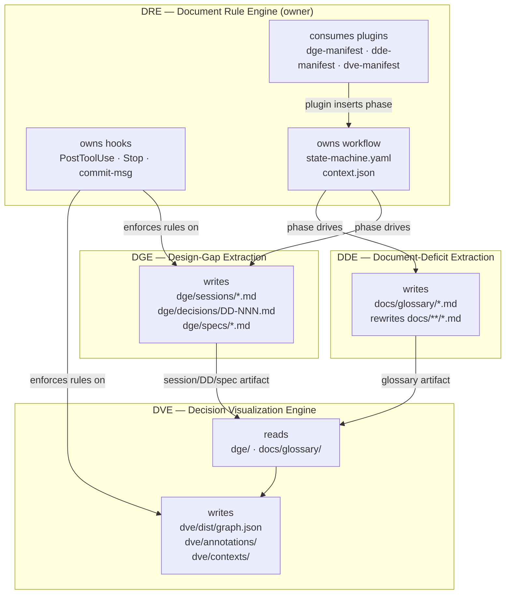
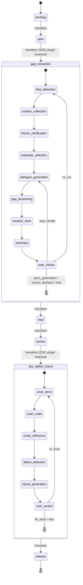
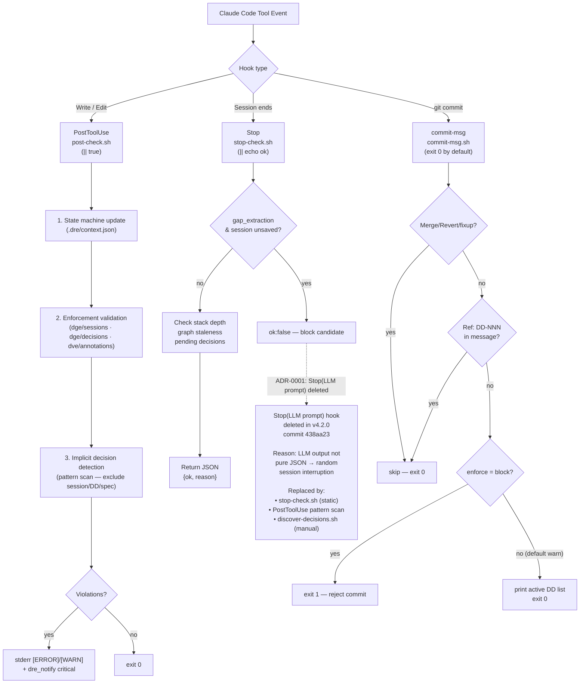
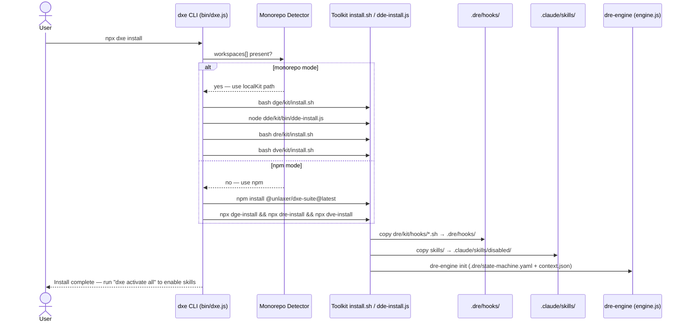

# DxE-suite — Technical Specification

- **Repository**: [opaopa6969/DxE-suite](https://github.com/opaopa6969/DxE-suite)
- **Version**: v4.2.0 (unified across DGE / DDE / DRE / DVE)
- **Status**: Authoritative — supersedes any per-toolkit spec fragments
- **Derived from**: [README.md](../README.md), [docs/architecture.md](../docs/architecture.md), [CHANGELOG.md](../CHANGELOG.md), `.dre/state-machine.yaml`, `dre/kit/hooks/*.sh`, `bin/dxe.js`
- **ADRs incorporated**:
  - [ADR-0001 — Remove Stop(LLM prompt) hook](../docs/decisions/0001-remove-stop-llm-prompt-hook.md)
  - [ADR-0002 — Archive DDE into the monorepo](../docs/decisions/0002-archive-dde-into-monorepo.md)

> **What this document is.** The single long-form description of *what*
> DxE-suite is, *how* it is built, *what contracts* the four toolkits
> honour, and *what known bugs / deferred issues* the reader must be aware
> of. It is structured in 12 sections so a reviewer can open the file at
> any section and read it in isolation.
>
> **What this document is not.** It is not a tutorial (see
> [getting-started.md](../docs/getting-started.md)), not a migration
> guide (see [migration-from-dde-toolkit.md](../docs/migration-from-dde-toolkit.md)),
> and not a CHANGELOG (see [CHANGELOG.md](../CHANGELOG.md)).

---

## Table of contents

1. [概要 — DGE / DDE / DVE / DRE monorepo v4.2.0](#1-概要--dge--dde--dve--dre-monorepo-v420)
2. [機能仕様 — 各 toolkit の役割表](#2-機能仕様--各-toolkit-の役割表)
3. [データ永続化層 — セッション/状態ファイル、dre-config.json、state-machine.yaml](#3-データ永続化層--セッション状態ファイルdre-configjsonstate-machineyaml)
4. [ステートマシン — DRE skill 制御、phase 遷移](#4-ステートマシン--dre-skill-制御phase-遷移)
5. [ビジネスロジック — skill 有効化規則、hook 戦略](#5-ビジネスロジック--skill-有効化規則hook-戦略)
6. [API / 外部境界 — dxe CLI / dve CLI / dre CLI](#6-api--外部境界--dxe-cli--dve-cli--dre-cli)
7. [UI — Preact + Cytoscape.js DVE Web UI](#7-ui--preact--cytoscapejs-dve-web-ui)
8. [設定 — workspaces bug を明示](#8-設定--workspaces-bug-を明示)
9. [依存関係 — monorepo 内部、DDE subtree](#9-依存関係--monorepo-内部dde-subtree)
10. [非機能要件 — hook latency](#10-非機能要件--hook-latency)
11. [テスト戦略](#11-テスト戦略)
12. [デプロイ / 運用 — npm publish per sub-package](#12-デプロイ--運用--npm-publish-per-sub-package)

---

## 1. 概要 — DGE / DDE / DVE / DRE monorepo v4.2.0

### 1.1 プロジェクトの目的

**DxE-suite** は、設計 → 決定 → 配布 → 文書補完のライフサイクルを
単一の monorepo で完結させるための Claude Code 用 toolkit 群である。
4 つの頭文字語が示す通り、**DxE** は次の文字列として展開される：

> **D**esign × **E**xtraction + **E**nforcement + **E**ngine

それぞれの **E** は、別個の toolkit として実装されている：

| 略称 | 正式名称 | 責務 |
|---|---|---|
| **DGE** | **D**esign-**G**ap **E**xtraction | 会話劇を通して **設計上の gap** を抽出する |
| **DDE** | **D**ocument-**D**eficit **E**xtraction | LLM + CLI で **文書上の不足** を抽出し、用語集を生成、docs を自動リンクする |
| **DVE** | **D**ecision **V**isualization **E**ngine | 決定の系譜を **可視化** する。DGE の再起動ハブでもある |
| **DRE** | **D**ocument **R**ule **E**ngine | rules / skills / hooks を **配布・施行** するエンジン |

四つのキーワードは独立に意味を持ち、かつ相互に補完的である。DGE
が "find" する。DVE が "visualize" する。DRE が "enforce / distribute"
する。DDE が "doc-link" する。

### 1.2 一本化されたバージョニング

v4.2.0 時点で、DGE / DDE / DRE / DVE の **全 toolkit が同一バージョン**
を持つ。`dxe status` コマンドの出力は次のようになる：

```text
  Mode: monorepo

  DGE: 4.2.0
  DDE: 4.2.0
  DRE: 4.2.0
  DVE: 4.2.0
```

同一バージョンでないもの＝ドリフト、という単純な運用ルールが成立する。
過去の分離リポジトリ時代、DDE のみ `0.1.x` で停滞していた時期があり、
`dxe status` の読解コストが高かった (ADR-0002 参照)。

### 1.3 主要な成果物

`dxe install` の実行で、次のものがプロジェクトに配置される：

- **22 個の Claude Code skill** (DGE 3 + DRE 13 + DVE 6) — `.claude/skills/`
- **DDE の追加 skill** (`dxe activate dde` で有効化時)
- **Hook manifest** (`.claude/settings.json`) — PostToolUse + Stop + commit-msg
- **Hook script** (`.dre/hooks/*.sh`) — `post-check.sh` / `stop-check.sh` / `commit-msg.sh` / `notify.sh`
- **Workflow state** (`.dre/state-machine.yaml` + `.dre/context.json`)
- **Config** (`.dre/dre-config.json`) — 通知チャンネル、Stop hook チューニング
- **DVE multi-project config** (`dve.config.json`) — monorepo の root 用

### 1.4 ライフサイクル全体像

```
  DGE (find)            DVE (visualize)        DRE (enforce + distribute)   DDE (doc-link)
  ─────────             ─────────              ─────────                    ─────────
  「DGE して」
      ↓
  dialogue → gaps
      ↓                                        PostToolUse hook
  session saved ──────→ dve build ←─────────── full dialogue text check
      ↓                    ↓
  DD recorded ─────────→ graph.json            commit-msg hook
      ↓                    ↓                   "Ref: DD-NNN" required
  spec written ────────→ Web UI
                           ↓
                      user browses
                           ↓                                                「DDE して」
                ┌── annotate / overturn / fork                                ↓
                ↓                                Stop hook                 terms extracted
         re-start DGE ←────────────── implicit-decision scan                  ↓
         (ContextBundle)              pending-decisions → Slack              articles
                ↓                                                             ↓
         new DD ─────────────────────→ rules/skills → dre/kit/            dde-link rewrites docs
                                              ↓
                                       plugin manifest → Slack
                                              ↓
                                       `npx dxe install` → whole team same env
```

### 1.5 成立背景

- **4.0.0 (2026-04-07)**: monorepo 統合。DGE / DRE / DVE を `DxE-suite`
  に集約。`dxe` CLI が workspaces を駆動するように書き直された
  (commit `c20feea`)。
- **4.1.0 (2026-04-08)**: DDE を subtree import で monorepo に取り込む
  (ADR-0002)。DRE の enforcement engine (hooks) を導入
  (commit `f8ef009`)。Slack 通知、DVE Slack Bot、`dve scan --audit` 追加。
- **4.2.0 (2026-04-09)**: Stop(LLM prompt) hook を削除 (ADR-0001)。
  DGE session dialogue のロスト問題を修正 (`596dd55`)。session / DD /
  spec ファイルを implicit-decision detection の対象から除外
  (`26f4167`)。DDE のバージョンを `0.1.x` から `4.2.0` へ統一
  (`7dec550`)。

---

## 2. 機能仕様 — 各 toolkit の役割表

### 2.1 責務表

| 関心 | DGE | DDE | DVE | DRE |
|---|---|---|---|---|
| 設計 **gap** を発見 | ✅ | | | |
| 文書 **deficit** を発見 | | ✅ | | |
| 決定グラフの可視化 | | | ✅ | |
| rules/skills/hooks の配布 | | | | ✅ |
| DD の記録 | writes `dge/decisions/DD-NNN.md` | | *read only* | enforces `Ref: DD-NNN` in commits |
| session の記録 | writes `dge/sessions/*.md` | writes `dde/sessions/*.md` | *read only* | enforces full dialogue |
| glossary の生成 | | writes `docs/glossary/*.md` | *read only* (hover) | |
| workflow の所有 | consumer | consumer | consumer | **owner** |
| hook の所有 | — | — | — | **owner** |



### 2.2 DGE — Design-Gap Extraction

**責務**: session / decision / spec を **writes** する。グラフ・用語集・
hook については **一切知らない**。

**入出力**:
- 入力: テーマ (ユーザ入力) + 自動収集コンテキスト (README / docs / tree / git log / DVE ContextBundle)
- 出力: `dge/sessions/*.md` (不変。全 dialogue text 保存)、`dge/decisions/DD-NNN.md`、`dge/specs/*.md`

**配布される skill** (3 個):
- `dge-session.md` — dialogue 実行
- `dge-update.md` — kit の更新
- `dge-character-create.md` — カスタム character 追加

**サブステートマシン** (DRE からの呼び出し時):
`flow_detection → context_collection → theme_clarification → character_selection → dialogue_generation → gap_structuring → session_save → summary → user_choice`
(分岐: `re_run` / `auto_iterate` / `spec_generation` / `record_decision` / `end`)

**品質基準**: 30 分の session で 3–7 個の architecture-level gap を
発見すること。"Scene" / "先輩" / "ナレーション" などの dialogue marker
が PostToolUse hook によって必須チェックされる (後述 §5.2)。

### 2.3 DDE — Document-Deficit Extraction

**責務**: 用語記事 (`docs/glossary/*.md`) を **writes** する。他の
Markdown を `[term](docs/glossary/xxx.md)` 形式で書き換える。

**入出力**:
- 入力: `docs/` 以下の既存 Markdown、source code
- 出力: `docs/glossary/*.md` (1 file = 1 term、初級 / 中級 / 上級の 3 reader level)

**配布される skill**:
- `dde-session.md` — DDE の実行 (抽出 → 記事生成 → rewrite)
- `dde-update.md` — kit の更新

**サブステートマシン**:
`scan_docs → scan_code → cross_reference → deficit_detection → report_generation → user_review`
(分岐: `fix_docs` / `skip` / `re_scan`)

**CI 用モード**: `npx dde-link --check` で CI 用に dangling reference を
検出。失敗時に exit 1。

**既知の未整備箇所**: `dde/kit` は npm workspaces に **未登録** である
（詳細は §8.2）。

### 2.4 DVE — Decision Visualization Engine

**責務**: **Read-and-render に徹する**。`dge/` / `dde/` に書き戻すことは
一切ない。自分の `graph.json`、`dve/annotations/`、`dve/contexts/` のみを
書く。

**入出力**:
- 入力: `dge/sessions/*.md`、`dge/decisions/DD-*.md`、`dge/specs/*.md`、
  `dve/annotations/*.md`、Git log
- 出力: `dve/dist/graph.json`、`dve/annotations/*.md` (user-driven)、
  `dve/contexts/*.json` (ContextBundle、DGE 再起動用)

**配布される skill** (6 個):
- `dve-build.md` / `dve-serve.md` / `dve-status.md` / `dve-trace.md` / `dve-annotate.md` / `dve-context.md`

**サブコンポーネント**:
- `parser/` — session / decision / spec / annotation / git / glossary / drift / state の 8 parser
- `graph/` — `schema.ts` + `builder.ts` + `query.ts` + `cluster.ts`
- `context/` — `bundle.ts` (DVE → DGE restart 用の ContextBundle 生成)
- `server/` — `api.ts` + `slack.ts` (Slack Bot 含む)
- `app/` — Preact + Cytoscape.js + Vite の Web UI (後述 §7)
- `scripts/` — `recover-all.sh` / `recover-dialogues.sh` / `discover-decisions.sh` / `audit-duplicates.sh`

**Core value**: "orphan Gap" (DD に resolve されていない Gap) を可視化
すること。これは DGE だけを見ていても発見できない、DVE 固有の価値。

### 2.5 DRE — Document Rule Engine

**責務**: workflow の **owner**。hook の **owner**。それ以外は plugin
に委譲する。

**設計原則**:
- **Rule as code**: ルールは Markdown や commandments ではなく、**実行される script** として実装する。`post-check.sh` の 1 行でも ignore すると CI が落ちる、というレベルにまで「書かれたルール」と「動くルール」のギャップを詰める。
- **Block sparingly, notify freely**: hook が commit や session を block するのはごく限定されたケースのみ。それ以外は通知 / ログで知らせる (ADR-0001 のトレードオフ方針)。
- **Plugin で orthogonal 拡張**: DRE 自身に DGE / DDE / DVE の知識をハードコードしない。plugin manifest で挿入する。

**入出力**:
- 入力: plugin manifest (`dre/kit/plugins/*.yaml`)、`.dre/context.json`、
  Claude Code の tool events
- 出力: `.dre/context.json` の書き戻し、`.dre/pending-decisions.json`、
  `.dre/notifications.json`、violation の stderr、Slack 通知

**配布される skill** (13 個):
- `dre-activate.md` / `dre-reset.md` / `dre-uninstall.md` — DRE 自体の操作
- `dxe-command.md` — `dxe` CLI のヘルプを agent に読ませるため
- `architect-to-task.md` / `backlog-management.md` / `doc-to-instruction.md` /
  `phase.md` / `release.md` / `spec-update.md` / `story-driven-discovery.md` /
  `test.md` — workflow phase ごとの skill

**Plugin**:
- `dge-manifest.yaml` — `gap_extraction` phase を `spec` の後に挿入
- `dde-manifest.yaml` — `doc_deficit_check` phase を `review` の後に挿入
- `dve-manifest.yaml` — phase は挿入しない (cross-cutting tool)

---

## 3. データ永続化層 — セッション/状態ファイル、dre-config.json、state-machine.yaml

### 3.1 ディレクトリ構造 (実ファイル)

```
DxE-suite/
├── dge/
│   ├── sessions/               immutable dialogue logs (YYYY-MM-DD-<slug>.md)
│   ├── decisions/              DD-NNN.md (one file per decision)
│   └── specs/                  UC / TECH / DD / DQ / ACT spec files
├── dde/
│   └── kit/                    (DDE sessions 等は kit 側に置く運用)
├── dve/
│   ├── annotations/            user comments / forks / overturns
│   ├── contexts/               generated ContextBundle JSON
│   └── dist/
│       └── graph.json          multi-project graph
├── .dre/
│   ├── state-machine.yaml      base workflow (backlog → … → release)
│   ├── context.json            current phase + stack + sub_state + history + plugins_sm
│   ├── dre-config.json         enforcement level, stop_hook, notifications
│   ├── pending-decisions.json  implicit decisions detected by PostToolUse
│   ├── notifications.json      notification history
│   └── hooks/                  symlink-equivalent copies of dre/kit/hooks/*
├── .claude/
│   ├── settings.json           hooks manifest (PostToolUse + Stop)
│   ├── skills/                 22 skill files (.md)
│   │   └── disabled/           skills shipped disabled
│   └── rules/
│       └── dre-skill-control.md  "disabled/ のファイルは無効" ルール
└── dve.config.json             multi-project DVE config
```

### 3.2 `.dre/state-machine.yaml`

`dxe install` 時に配置される **base workflow** の定義：

```yaml
version: 1
phases:
  - id: backlog
    next: spec
    description: "Requirements gathering, story writing"
  - id: spec
    next: gap_extraction
    description: "Design, docs, architecture, DGE sessions"
  - id: gap_extraction
    next: impl
    description: "Run DGE sessions to discover design gaps"
  - id: impl
    next: review
    description: "Build features from spec"
  - id: review
    next: release
    description: "Code review, test coverage, stabilization"
  - id: release
    next: null
    description: "Release prep, deployment, maintenance"
```

実際に有効な workflow は、この YAML に plugin manifest
(`dre/kit/plugins/*.yaml`) が **挿入** されて決定される：

- DGE plugin: `gap_extraction` phase を `spec` の後に挿入。独自の
  10 状態のサブステートマシンを持つ。
- DDE plugin: `doc_deficit_check` phase を `review` の後に挿入。7 状態の
  サブステートマシンを持つ。
- DVE plugin: phase は挿入しない。独自の 5 状態のサブステートマシンを
  持つ (build_graph / render / interact / create_annotation / generate_context)。

### 3.3 `.dre/context.json`

現在の workflow state。構造は以下の通り：

```json
{
  "current_phase": "gap_extraction",
  "stack": ["gap_extraction"],
  "frames": {},
  "history": [
    { "phase": "backlog", "timestamp": "…", "action": "init" },
    { "phase": "gap_extraction", "timestamp": "…", "action": "transition from backlog" },
    { "phase": "gap_extraction/flow_detection", "timestamp": "…", "action": "sub-transition (enter)" },
    { "phase": "gap_extraction/dialogue_generation", "timestamp": "…", "action": "sub-transition from flow_detection" }
  ],
  "plugins_sm": {
    "gap_extraction": {
      "plugin": "dge",
      "states": [ /* DGE sub-state definitions */ ],
      "current": "dialogue_generation"
    }
  },
  "sub_state": "dialogue_generation"
}
```

**Invariants**:
- `current_phase` は必ず `.dre/state-machine.yaml` の `phases[].id` のいずれか、または
  plugin が挿入した phase のいずれかと一致する。
- `stack[-1]` == `current_phase` が常に成立 (PostToolUse hook が更新)。
- `history` は append-only。削除しない。

### 3.4 `.dre/dre-config.json`

enforcement tuning の単一ソース：

```json
{
  "enforcement":        { "level": "full" },
  "stop_hook":          { "llm_decision_review": true },
  "decision_detection": { "realtime": true },
  "commit_dd_reference":{ "enforce": "warn" },
  "notifications":      { "channel": "slack", "min_level": "critical" }
}
```

**各フィールドの意味**:
- `enforcement.level`: `"full"` (command + LLM prompt hook) / `"lite"` (command only)。
  v4.2.0 時点で LLM prompt hook は削除済みだが、設定は過去互換のために残存。
- `stop_hook.llm_decision_review`: `true` で LLM が Stop 時に会話を review。
  現在は command-only で動作するため、実効上は無視される (ADR-0001)。
- `decision_detection.realtime`: `true` で PostToolUse が decision pattern
  を走査する。`false` なら `discover-decisions.sh` の手動実行に依存。
- `commit_dd_reference.enforce`: `"warn"` / `"block"`。`"warn"` はログ表示のみ、
  `"block"` は `git commit` を reject する。
- `notifications`:
  - `channel`: `slack` / `discord` / `webhook` / `desktop` / `none`
  - `min_level`: `critical` / `daily` / `all` / `none`
  - URL は `DRE_NOTIFY_URL` 環境変数で与える。

### 3.5 `.dre/pending-decisions.json`

PostToolUse hook が検出した **implicit decision** の蓄積：

```json
{
  "pending": [
    {
      "timestamp": "2026-04-08T01:24:05Z",
      "file": "docs/architecture.md",
      "line": 42,
      "text": "Preact にする (Vue はやめる) …"
    }
  ]
}
```

検出 pattern は `post-tool-use.sh` 内にハードコードされている (§5.3)。

### 3.6 `dve/dist/graph.json`

DVE の描画ソース。`DVEGraph` 型 (`dve/kit/graph/schema.ts`)：

```typescript
interface DVEGraph {
  generated_at: string;
  project: string;
  nodes:   Array<Node>;   // Session | Dialogue | Gap | Decision | Spec | Annotation
  edges:   Array<Edge>;   // contains | discovers | resolves | supersedes | annotates | produces | implements
  stats:   { sessions, gaps, decisions, specs, annotations };
  warnings:Array<Warning>;
}
```

- multi-project の場合は `graph-<name>.json` というファイルが projects 毎に作成される。
- `node.content` に Markdown 全文をインラインする (静的レンダリング用)。

### 3.7 `dge/sessions/*.md` の制約

PostToolUse hook (§5.2) が以下を強制：

- **MUST**: dialogue marker (`Scene` / `先輩` / `ナレーション` / 絵文字 ☕👤🎩😰⚔🎨📊) のいずれかを含む
- **MUST**: `Gap 発見` / `Gap 一覧` / `→ Gap` のいずれかを含む
- **SHOULD**: 番号付き選択肢を 3 件以上含む (`^[0-9]+\.` pattern)

違反時は `[ERROR]` (block 可能) または `[WARN]` (log only) として stderr に出力される。

### 3.8 `dge/decisions/DD-*.md` の制約

- **SHOULD**: `Session:` または `sessions/` 文字列を含む (originating session への参照)
- **SHOULD**: `## Rationale` または `## Decision` セクション
- **SHOULD**: `Date:` フィールド

### 3.9 `dve/annotations/*.md` の制約

- **MUST**: `target:` フィールド
- **SHOULD**: `action:` フィールド (`comment` / `fork` / `overturn` / `constrain` / `drift` のいずれか)

### 3.10 `dve/contexts/*.json` の制約

- **MUST**: `type == "dve-context-bundle"`
- **MUST**: `origin.node_id` 非空

### 3.11 Markdown ヘッダ規約

#### 3.11.1 `dge/sessions/*.md`

```markdown
# Session: <theme>

- Date: YYYY-MM-DD
- Flow: quick | design-review | brainstorm | tribunal | wargame | pitch | consult | investigation
- Structure: roundtable | tribunal | wargame | ...
- Characters: [Yang, Imaizumi, Architect, Craftsman]

## Scene 1 — <scene-title>

> ナレーション: ...

**先輩 (Yang)**: ...

**今泉 (Imaizumi)**: ...

→ Gap 発見 G-1: <summary>  `[Category: X | Severity: High]`

## Gap 一覧

1. G-1: <summary>
2. G-2: <summary>

## 選択肢

1. もう一度 DGE する (theme を絞って)
2. auto-iterate する (flow を切り替えて)
3. spec に書き起こす
4. DD として記録する
5. 終了
```

必須要素:
- `Scene` / `先輩` / `ナレーション` のいずれか (dialogue marker)
- `→ Gap` / `Gap 発見` / `Gap 一覧` のいずれか (gap marker)
- 番号付き選択肢 3 件以上 (SHOULD)

#### 3.11.2 `dge/decisions/DD-*.md`

```markdown
# DD-007: <title>

- Date: 2026-04-19
- Status: active
- Session: dge/sessions/2026-04-19-askos-workspace.md
- Gap: #G-2, #G-3
- Supersedes: (none)

## Decision

<1-2 sentence decision statement>

## Rationale

<why this decision>

## Consequences

- Positive: ...
- Negative: ...
```

必須要素:
- Session ref (`Session:` または `sessions/`) → SHOULD
- `## Rationale` または `## Decision` セクション → SHOULD
- `Date:` フィールド → SHOULD

#### 3.11.3 `dge/specs/*.md`

```markdown
# <spec-title> [<type>-NNN]

- Status: draft | reviewed | migrated
- Session: dge/sessions/...
- Decisions: DD-007

## Background

## Design

## Acceptance criteria
```

`type` は UC / TECH / DD / DQ / ACT のいずれか。

#### 3.11.4 `dve/annotations/*.md`

```markdown
---
target: DD-007
target_line: 42
action: overturn
author: opa
date: 2026-04-19
---

<body Markdown>
```

YAML frontmatter + body の形式。`target` / `action` は parser が
`grep` で検出するため、frontmatter 外に書かれていても動作する。

### 3.12 Immutability 原則

`dge/sessions/*.md` は **書き換えてはならない**。誤記を正す必要がある場合は、新しい session を作成し、古い session に annotation (`action: drift`) を付ける。

`dge/decisions/DD-*.md` は `supersedes` / `superseded_by` を使って世代管理する。古い DD の内容書き換えは **禁止**。

PostToolUse hook は現状これらの immutability を強制していない (warn のみ)。将来的に「既存 session の上書き」を block する ERROR rule を追加する可能性がある。

### 3.13 `.dre/notifications.json` の構造

```json
{
  "history": [
    {
      "timestamp": "2026-04-08T10:24:15Z",
      "level": "critical",
      "title": "Enforcement violation",
      "body": "dge-session: No dialogue text...",
      "channel": "slack",
      "delivered": true
    }
  ]
}
```

- `delivered: false` の場合、`DRE_NOTIFY_URL` 未設定 / HTTP 失敗 / rate limit 等で送信できなかったことを示す。
- retention: 現状無制限。backlog に「30 日超で purge」を入れている。

### 3.14 `.dre/hooks/` と `dre/kit/hooks/` の関係

`dxe install` / `dxe update` は `dre/kit/hooks/*.sh` を `.dre/hooks/` に **コピー**する。symlink ではない (npm install 後のパーミッション問題を避けるため)。

```
dre/kit/hooks/
├── post-tool-use.sh      ─┐
├── stop-check.sh          ├─ copy on install/update
├── commit-msg.sh          │
├── notify.sh              │
├── enforcement-rules.yaml ─┤
├── settings.json          ─┘  (→ .claude/settings.json)
└── dre-config.json        ─── (→ .dre/dre-config.json の初期値)
```

`.dre/hooks/` に直接手を入れても、次の `dxe update` で上書きされる。**恒久的変更は `dre/kit/hooks/` 側に入れる**。

---

## 4. ステートマシン — DRE skill 制御、phase 遷移

### 4.1 Phase の階層構造

DRE は **二階層のステートマシン** を管理する：

```
┌─────────────── Base workflow (DRE が所有) ───────────────┐
│ backlog → spec → gap_extraction → impl → review → release │
│                       ↑                       ↑           │
│                  DGE plugin               DDE plugin      │
│              (gap_extraction を挿入)  (doc_deficit_check を挿入) │
└─────────────────────────────────────────────────────────┘
                       ↓
┌───── Sub-state machine (plugin が所有) ─────┐
│ (gap_extraction の内部)                      │
│   flow_detection → context_collection →     │
│   theme_clarification → character_selection │
│   → dialogue_generation → gap_structuring → │
│   session_save → summary → user_choice      │
│     branches: re_run / auto_iterate /       │
│               spec_generation / record_decision / end │
└──────────────────────────────────────────────┘
```



### 4.2 遷移操作

workflow engine (`dre/kit/engine/engine.js` → alias `dre-engine`) は以下の操作をサポート：

- **`init`**: `.dre/state-machine.yaml` と `.dre/context.json` を生成し、
  `dre/kit/plugins/*.yaml` の全 manifest を順次 merge する。
- **`status`**: 現在の phase / stack / sub_state / plugin 一覧を表示。
- **`transition <phase>`**: `current_phase` を変更、`stack[-1]` を上書き、
  `history` に `transition from <old>` を追加。
- **`sub-transition <state>`**: plugin sub-state を変更、`plugins_sm.<current_phase>.current`
  と top-level `sub_state` を上書き、`history` に記録。
- **`push <phase>`**: `stack.push(phase)` + `current_phase = phase`。drill-down 用。
- **`pop`**: `stack.pop()` + `current_phase = stack[-1]`。drill-down から戻る。
- **`install-plugin <file>`**: YAML manifest を読み込み、`state-machine.yaml` に挿入。

### 4.3 PostToolUse hook による自動遷移

PostToolUse hook (`post-tool-use.sh`) は **tool の返り値** を読み、
特定の `state` フィールドが返ってきた場合に自動で sub-transition を行う：

```bash
STATE=$(echo "$INPUT" | jq -r '.tool_result.content // empty' | jq -r '.state // empty')
TRANSITION=$(echo "$INPUT" | jq -r '.tool_result.content.transition.on_complete // empty')

if [ "$TRANSITION" = "POP" ]; then
  # stack pop + phase rewind
else
  # phase = STATE, stack[-1] = STATE, history += "tool-transition"
fi
```

これにより、skill の実行結果として `state: "dialogue_generation"` を返せば、
context.json は自動で同期される。

### 4.4 `dre-skill-control.md` ルール

`.claude/rules/dre-skill-control.md` の全文：

> `.claude/skills/disabled/` に移動されたスキルファイルは**無効**です。
> そのファイルのトリガーや手順には従わないでください。
>
> 有効なスキルは `.claude/skills/` 直下のファイルのみです。
>
> スキルの有効化・無効化には `dre activate` / `dre deactivate` を使ってください。

Claude Code の skill ローダは `.claude/skills/` 全体を走査するが、`disabled/`
サブディレクトリに置かれたファイルは **このルールにより** agent が無視する。
物理的な移動 (`fs.renameSync`) + ルールファイル、の二段構えで skill を
「無効化」する。

### 4.5 保護された skill

`dxe deactivate` は次の skill を deactivate 対象から **除外** する (物理移動しない)：

- `dxe-command.md` — `dxe` CLI のヘルプを agent に読ませる最低限の skill。
- `dre-activate.md` — `dxe activate` 実行用の skill。これを deactivate すると
  復帰できなくなる。

### 4.6 Skill 一覧 (22 個)

#### DGE (3)

- `dge-session.md` — session 実行
- `dge-update.md` — kit 更新
- `dge-character-create.md` — カスタム character 追加

#### DRE (13)

- `dre-activate.md` (保護) / `dre-reset.md` / `dre-uninstall.md`
- `dxe-command.md` (保護)
- `architect-to-task.md` / `backlog-management.md` / `doc-to-instruction.md`
- `phase.md` / `release.md` / `spec-update.md`
- `story-driven-discovery.md` / `test.md`

#### DVE (6)

- `dve-build.md` / `dve-serve.md` / `dve-status.md`
- `dve-trace.md` / `dve-annotate.md` / `dve-context.md`

#### DDE (`dxe activate dde` で追加)

- `dde-session.md` / `dde-update.md`

---

## 5. ビジネスロジック — skill 有効化規則、hook 戦略

### 5.1 Skill 有効化規則

`bin/dxe.js` の `activate` コマンドは、`.claude/skills/disabled/` から
`.claude/skills/` にファイルを物理移動する：

```javascript
const SKILL_PREFIXES = {
  dge: ['dge-'],
  dde: ['dde-'],
  dre: ['dre-', 'dxe-', 'architect-', 'backlog-', 'doc-to-',
        'phase', 'release', 'spec-', 'story-', 'test'],
  dve: ['dve-'],
  all: null,   // all skills
};
```

prefix match により toolkit 単位でバルク操作が可能。

### 5.2 PostToolUse hook の戦略

**設計方針**: *hook 失敗でユーザをブロックしない*。ADR-0001 の結論に従って、
`.claude/settings.json` は次のように記述する：

```json
{
  "hooks": {
    "PostToolUse": [{
      "matcher": "Write|Edit|write|edit",
      "hooks": [{
        "type": "command",
        "command": "bash .dre/hooks/post-check.sh 2>/dev/null || true"
      }]
    }],
    "Stop": [{
      "hooks": [{
        "type": "command",
        "command": "bash .dre/hooks/stop-check.sh 2>/dev/null || echo '{\"ok\": true}'"
      }]
    }]
  }
}
```

`|| true` / `|| echo '{"ok": true}'` により、hook script のバグが
セッションを halt することはない。トレードオフ: **壊れた hook は静かに
検査を落とす**。運用チームはそれを許容する (ADR-0001 § Consequences)。



### 5.3 PostToolUse `post-check.sh` の検査項目

1. **State machine update**: tool result の `state` / `transition.on_complete`
   を読み、`.dre/context.json` を更新する (§4.3)。
2. **Enforcement validation**: tool が書いたファイルのパスに応じて
   規則を適用：
   - `dge/sessions/*.md` → dialogue marker + Gap marker 必須 (§3.7)
   - `dge/decisions/DD-*.md` → Session ref + Rationale + Date 推奨 (§3.8)
   - `dge/specs/*.md` → Status + Session ref 推奨
   - `dve/annotations/*.md` → target / action 必須 (§3.9)
   - `dve/contexts/*.json` → type / origin 必須 (§3.10)
   - `.claude/rules/` / `.claude/skills/` → 保護ファイルの上書き警告
3. **Implicit decision detection**: `dge/*` 配下の sessions / decisions /
   specs **以外** の書き換えについて、日本語 + 英語の decision pattern
   (`にしよう|に決定|で行く|を採用|...|Decided:|chose`) を検出し、
   `.dre/pending-decisions.json` に追記する。
   - false positive 対策: session/DD/spec ファイルは **除外** (v4.2.0 で修正、
     commit `26f4167`)。character dialogue が pattern にヒットしてしまう
     問題を解消。

### 5.4 Stop hook `stop-check.sh` の検査項目

1. **DGE gap_extraction phase 中かつ session 未保存** → block 候補
2. **Stack 深度 > 1** (drill-down 未完了) → block 候補
3. **DVE graph.json が stale** (session/DD より古い) → info
4. **`.dre/pending-decisions.json` に item あり** → info
5. **直近 commit の `Ref: DD-NNN` 欠落** → info

返り値は `{"ok": true}` または `{"ok": false, "reason": "..."}` の JSON。
`reason` に `MUST` / `gap_extraction` / `no dialogue` が含まれれば
`critical` レベルで通知、`implicit decisions` なら `daily` レベル。

### 5.5 ADR-0001 — Stop(LLM prompt) hook の削除理由 (要約)

過去、Stop hook には 2 variant (command / prompt) があった。prompt
variant は会話全体を LLM に読ませて implicit decision を抽出させていたが、
出力が常に pure JSON にならず (prose preamble / markdown fence /
refusal message の混入)、`JSON validation failed` エラーで **session を
ランダムに中断** していた。

prompt hardening (commit `3beb67f`) で緩和したが根本解決せず、commit
`438aa23` で完全削除。現在は `stop-check.sh` の静的検査 + PostToolUse
の pattern 検出 + `discover-decisions.sh` の手動 retro-scan の 3 段で代替。

### 5.6 commit-msg hook

`.git/hooks/commit-msg` にコピーされる `commit-msg.sh` は：

1. Merge / Revert / fixup! / squash! は skip
2. commit message に `Ref: DD-NNN` または `DD-NNN` が含まれれば skip
3. `dge/decisions/` 配下に DD ファイルが 0 件なら skip
4. それ以外は、active な DD 一覧を stderr に **ヒント表示** (現行設定は warn)

`.dre/dre-config.json` の `commit_dd_reference.enforce` が `"block"` なら
`exit 1` で reject できるが、デフォルトは `"warn"`。

### 5.7 通知戦略

`notify.sh` が `dre_notify <level> <title> <body>` 関数を export。
`DRE_NOTIFY_URL` + `.dre/dre-config.json` の channel 設定を組み合わせて
Slack / Discord / webhook / desktop / none に通知する。

**Level フィルタ**:
- `critical` → enforcement violation / Stop block / DD overturn
- `daily` → pending decisions / orphan Gaps / drift
- `info` → graph stale / build done
- `none` → 全 mute

### 5.8 除外すべき決定検出 pattern

commit `26f4167` 以降、PostToolUse は次のパスを implicit decision
detection から **除外** する：

- `*dge/sessions/*`
- `*dge/decisions/*`
- `*dge/specs/*`
- `*dve/annotations/*`
- `*dve/contexts/*`

理由: これらは「決定表現を含むことが本務」の artifact なので、検出すると
noise になる。

### 5.9 Decision pattern の具体 (日本語 + 英語)

`post-tool-use.sh` 内にハードコードされているパターン：

```
にしよう
にする$
に決定
で行く
を採用
を選択
で確定
却下
不要
を使う
に変更
で十分
にした$
やめる
使わない
方針:
決定:
確定:
Direction:
Decision:
Decided:
chose
settled on
going with
```

**ノイズ除外**:
- 15 文字未満の行は skip (例: `"やめる"` 単独は skip)
- `^[{}\[\]<>]` / `^import ` / `^const ` / `^function ` / `^if ` / `^for ` で始まる行は skip (code-like)
- session / decision / spec / annotation / context ファイル全体を skip (§5.8)

### 5.10 Enforcement severity の意味

`enforcement-rules.yaml` の `severity`:

| severity | 意味 | hook の action |
|---|---|---|
| `error` | block 候補 | stderr に `[ERROR]` 出力。`ERRORS` カウンタ incr。commented-out の `exit 1` を有効にすれば session を block |
| `warn` | 警告のみ | stderr に `[WARN]` 出力。block しない |

v4.2.0 時点では、`exit 1` は **常にコメントアウト** されている。すなわち hook は実質的に notify-only である。将来 `enforcement.level: "strict"` を `.dre/dre-config.json` に追加し、それが true なら `exit 1` を有効化する案あり。

### 5.11 State machine 更新の順序性

PostToolUse hook は以下の順で実行される (上から):

1. stdin 読み込み (`INPUT=$(cat)`)
2. `TOOL_NAME` / `FILE_PATH` 抽出
3. **State Machine Update** (§4.3) — tool_result.content.state を見て `.dre/context.json` を更新
4. Write/Edit でなければ `exit 0`
5. FILE_PATH が存在しなければ `exit 0`
6. **Enforcement Validation** (§5.3-2) — 種別ごとのルール
7. **Decision Detection** (§5.3-3, §5.9) — pattern scan
8. 違反を stderr に集約して出力
9. notify.sh を load して `dre_notify critical ...` を発動 (violation がある時)

これらはすべて **直列** であり、hook の実行時間は各ステップの和になる (§10.1)。

---

## 6. API / 外部境界 — dxe CLI / dve CLI / dre CLI

### 6.1 `dxe` CLI (`bin/dxe.js`)

```
npx dxe install                  DGE + DRE + DVE (default targets) をインストール
npx dxe install dde              1 toolkit のみ
npx dxe update                   全 toolkit をアップデート + changelog 表示 + Slack 通知
npx dxe update --yes             確認なし
npx dxe activate all             全 skill を enable
npx dxe activate dge             1 toolkit 分の skill を enable
npx dxe deactivate dve           1 toolkit 分の skill を disable
npx dxe status                   インストール状況 (monorepo mode / npm mode)
```

**Monorepo 検出**: `package.json` に `workspaces` 配列があり、かつ
そのうち少なくとも 1 workspace のディレクトリが実在すれば monorepo mode。
そうでなければ npm mode。

**Monorepo mode**: `TOOLKITS[name].localKit` 配下の `install.sh` / `update.sh`
を直接実行する。DDE だけは `runWith: 'node'` 指定があり、
`dde/kit/bin/dde-install.js` を node で実行する (§8.2 参照)。

**npm mode**: `npm install <pkg>@latest` → `npx <tk>-install` → `npx <tk>-update`。

**i18n**: `--lang=ja` / `--lang=en` または環境変数 `LANG` を見て切り替える。
help message・installing message だけが翻訳対象。



### 6.2 `dve` CLI (`dve/kit/cli/dve-tool.ts`)

```
dve build                        全 project の graph.json を build
dve serve [--watch]              Web UI + API (ports 4173 + 4174)
dve status                       workflow SM + plugins の sub-state を表示
dve scan [dir] [-r] [-a]         DxE project 自動発見 + 登録 + 監査
dve trace DD-002                 因果チェーン (DD → Gap → Session)
dve impact DD-002                influence radius
dve orphans                      DD 未割当の Gap 一覧
dve search "keyword"             graph 全文検索
dve annotate <id> --action ...   annotation 作成
dve context <id>                 ContextBundle 生成 (DGE restart 用)
dve clusters                     DD クラスタリング (supersedes 連鎖)
dve drift                        drift 検出 (code vs decision の乖離)
```

**Multi-project mode**: `dve.config.json` の `projects[]` を走査し、
各 project に対して `graph-<name>.json` を出力する。`outputDir` は
絶対パス。project の `path` は root からの相対 or 絶対。

**Server port**: API server はデフォルト `4174`、`app/` からの Vite
preview は `4173`。`dve serve --watch` で両方を起動する。

### 6.3 `dre-engine` CLI (`dre/kit/engine/engine.js`)

```
dre-engine init                  .dre/ を初期化 + plugin 自動検出
dre-engine status                workflow SM + sub-states を表示
dre-engine transition <phase>    phase 遷移
dre-engine sub-transition <s>    plugin sub-state 遷移
dre-engine push <phase>          stack push
dre-engine pop                   stack pop
dre-engine install-plugin <f>    plugin manifest を追加
```

YAML parser は deps なしの手書き (`engine.js` の `parseYaml` / `parsePluginManifest`)。
manifest の format が厳密でないと silently skip する。

### 6.4 外部 bin エントリーポイント一覧

`package.json` の `bin` フィールドが定義する実行可能ファイル：

| 配置 | 名前 | 用途 |
|---|---|---|
| `DxE-suite/package.json` | `dxe` → `./bin/dxe.js` | 統合 CLI |
| `dde/kit/package.json` | `dde-install`, `dde-tool`, `dde-link`, `dde-update` | DDE ツール群 |
| `dge/kit/package.json` | `dge-install`, `dge-update` | DGE ツール群 |
| `dre/kit/package.json` | `dre-install`, `dre-update`, `dre-engine`, `dre-tool` | DRE ツール群 |
| `dve/kit/package.json` | `dve-install`, `dve-update`, `dve-tool` | DVE ツール群 |

---

## 7. UI — Preact + Cytoscape.js DVE Web UI

### 7.1 構成

- **framework**: Preact 10.22+
- **graph**: Cytoscape.js 3.30+ with `cytoscape-dagre` layout
- **build**: Vite 5.4+
- **language**: TypeScript 5.0+

### 7.2 コンポーネント (`dve/app/src/`)

```
App.tsx                   ルート、routing (hash-based)
main.tsx                  Preact mount
components/
  GraphContainer.tsx      Cytoscape の container。layout + interaction
  NodeStyles.ts           node 種別ごとの色 / shape / size
  SearchBar.tsx           全文検索 (graph.nodes を scan)
  AnnotationDialog.tsx    annotation 作成 modal
  Tooltip.tsx             hover 時の用語 definition 表示
  Markdown.tsx            共通 Markdown renderer
  Onboarding.tsx          初回起動時のガイド
views/
  DetailPanel.tsx         node クリック時の詳細パネル
  DialogueView.tsx        session dialogue の行単位 render
  ScanView.tsx            `dve scan` 結果の表示
  CoverageView.tsx        DD coverage / orphan Gap の一覧
  ProjectList.tsx         multi-project selector
  StateChart.tsx          workflow SM の Mermaid 描画
lib/
  graph-loader.ts         `graph.json` / `graph-<name>.json` fetch
```

### 7.3 URL routing

hash-based。例：

- `/#/` — project list
- `/#/project/DxE-suite` — project root
- `/#/decision/DD-003` — 特定 DD を highlight
- `/#/gap/2026-04-05#G-2` — 特定 Gap を highlight
- `/#/coverage` — coverage view

(commit `07b20e5` で導入)

### 7.4 描画モデル

- node 種別 6 種: `session` / `dialogue` / `gap` / `decision` / `spec` / `annotation`
- edge 種別 7 種: `contains` / `discovers` / `resolves` / `supersedes` / `annotates` / `produces` / `implements`
- node の `data.content` に Markdown 全文がインラインされているため、
  API server なしで `dve build` 後の static 配信だけでも動作する。

### 7.5 API server (`dve/kit/server/api.ts`)

Web UI が書き込み (annotation 作成) を行う時のみ必要：

- `POST /annotations` → `dve/annotations/*.md` を作成
- `POST /scan` → `dve scan` 相当
- `GET  /status` → workflow status
- `GET  /drift` → drift detection
- `GET  /coverage` → coverage metrics
- `POST /slack` → Slack Bot entry point (slash command / Events API)

### 7.6 Slack Bot

`server/slack.ts` が実装。slash command・Events API・Block Kit の list
button・interactive endpoint をサポート。詳細は [slack-setup.md](../docs/slack-setup.md)。

### 7.7 Glossary / hover

DDE が生成した `docs/glossary/*.md` を DVE Web UI が自動 load し、
session dialogue / DD / spec の本文中の用語を下線 + hover tooltip で
表示する (commit `3db61c0`)。

### 7.8 Node 視覚化仕様

`NodeStyles.ts` が持つ色/形の convention:

| NodeType | Shape | Color (active) | Color (archived/void) |
|---|---|---|---|
| `session` | rounded rectangle | #4A90E2 (blue) | #AAB8C2 |
| `dialogue` | ellipse (small) | #9B9B9B | — |
| `gap` | diamond | #E06C75 (red, Critical/High) / #E5C07B (yellow, Medium) / #98C379 (green, Low) | #D0D0D0 |
| `decision` | hexagon | #C678DD (purple, active) | #6B6B6B (overturned) |
| `spec` | rectangle | #56B6C2 (cyan) | — |
| `annotation` | pin icon | #D19A66 (orange) | — |

Edge の描画は `EdgeType` に応じて実線 / 点線 / 矢印スタイルが変わる。
`confidence: "inferred"` は点線。`supersedes` edge は矢印が赤で太い。

### 7.9 Layout algorithm

既定は `cytoscape-dagre` の rank-based layout。ユーザは UI 上で以下を
切り替え可能:

- **hierarchical (dagre)** — rank が top-down (Session → Gap → DD → Spec)
- **force-directed (cola)** — 密度が均一になる物理 simulation (option)
- **manual** — ユーザが drag で配置を固定

`graph.json` には座標を persist しない。UI 側が localStorage に保存。

### 7.10 Preact + Vite の選択理由

- **Preact**: React と API 互換ながら **~3KB gzipped**。OSS distribution
  に組み込んでも total JS size が軽い。
- **Vite**: hot reload が高速。`preact/preset-vite` で JSX 変換が
  zero-config。
- **Cytoscape.js**: graph rendering の de facto standard。extension 生態系が
  広い (dagre / cola / cose-bilkent / cxtmenu など)。

**却下された代替案**:
- **D3.js**: データ driven visualization に優れるが、graph のノード/
  edge を扱う抽象度が低く、インタラクション実装コストが高い。
- **React + reactflow**: react-flow の扱いやすさは魅力だが、React 本体が重い。
- **Svelte**: 魅力的だが、team の JSX 熟度との折り合いで却下。

### 7.11 State management

Preact の `useState` / `useReducer` のみ。Redux / Zustand 等の外部
state management library は導入していない。graph.json 全体を
`useState` に読み込んで、selection / highlight / filter は
derived state で表現する。

### 7.12 Accessibility

- キーボード navigation: `/` で search focus、`Esc` で panel close、
  `←→` で node 間遷移。
- color-blind safe palette (赤+青+黄の軸を色と形の両方で表現)。
- screen reader 対応: 未整備 (backlog)。

---

## 8. 設定 — workspaces bug を明示

### 8.1 `package.json` (monorepo root)

```json
{
  "name": "@unlaxer/dxe-suite",
  "version": "4.2.0",
  "workspaces": [
    "dge/kit",
    "dge/server",
    "dre/kit",
    "dve/kit"
  ],
  "bin": { "dxe": "./bin/dxe.js" }
}
```

### 8.2 **既知のバグ — `dde/kit` が workspaces に未登録**

`workspaces` 配列に **`dde/kit` が含まれていない**。結果として：

| 影響 | 症状 |
|---|---|
| `npm install` at root | `dde/kit/node_modules/` に hoist されない |
| `npm run --workspace=dde/kit …` | 動作しない (workspace 認識されない) |
| `@unlaxer/dde-toolkit` の cross-workspace resolve (from `dge/kit` 等) | fail |
| `npx dxe install dde` | **動作する** — `bin/dxe.js` が直接 `dde/kit/bin/dde-install.js` を node 呼び出しするため、workspaces 登録に依存しない |

**本来あるべき設定** ([docs/architecture.md § 2.2](../docs/architecture.md#22-what-is-missing--known-bug)):

```json
"workspaces": [
  "dge/kit",
  "dge/server",
  "dde/kit",
  "dre/kit",
  "dve/kit"
]
```

**修正が保留されている理由**: `dde/kit/package.json` が
`dde-install` / `dde-tool` / `dde-link` / `dde-update` という 4 つの `bin`
エントリを定義している。これらが hoist 時に他 workspace の bin と
衝突しないかを事前検証してから `"dde/kit"` を追加する必要がある
([migration-from-dde-toolkit.md § collisions-to-watch-for](../docs/migration-from-dde-toolkit.md#collisions-to-watch-for))。

**このバグは documentation-first** として扱われている: 直す意図は確定
しているが、`package.json` 編集は未着手 (ADR-0002 § Consequences § Negative)。

### 8.3 `dve.config.json` (multi-project)

```json
{
  "outputDir": "/absolute/path/to/dve/dist",
  "projects": [
    { "name": "kit",              "path": "../DDE-toolkit/kit" },
    { "name": "DxE-suite",        "path": "." },
    { "name": "propstack",        "path": "../propstack" },
    { "name": "syslenz",          "path": "../syslenz" },
    { "name": "volta-auth-proxy", "path": "../volta-auth-proxy" },
    { "name": "volta-platform",   "path": "../volta-platform" }
  ]
}
```

- 単一プロジェクトのみの場合、`dve.config.json` が無くても
  `singleProjectConfig(CWD)` が fallback として使われる。
- `outputDir` は絶対パス推奨。相対パスの場合は `CWD` 起点で解決。

### 8.4 `.dre/dre-config.json`

§3.4 で既述。enforcement / stop_hook / decision_detection / commit_dd_reference /
notifications の 5 セクション。

### 8.5 `.claude/settings.json`

§5.2 で既述。PostToolUse + Stop hook の manifest。`dre/kit/hooks/settings.json`
と同期する必要がある (`dxe update` が自動反映)。

### 8.6 環境変数

| 変数 | 用途 | 既定 |
|---|---|---|
| `DRE_NOTIFY_URL` | Slack/Discord/webhook の POST 先 | 未設定＝通知なし |
| `DXE_LANG` | CLI 言語 (ja/en) | `LANG` から推定 |
| `LANG` | fallback の言語判定 | — |

---

## 9. 依存関係 — monorepo 内部、DDE subtree

### 9.1 npm 依存関係 (root)

root の `package.json` は **runtime dependency を一切持たない**。
`workspaces` を通じて子パッケージの依存を hoist するのみ。

### 9.2 子パッケージの主要依存

- **`dge/kit`**: シェルスクリプト + Markdown が中心。`package.json` は
  あるが、runtime dep はほぼない。
- **`dge/server`**: character-recommendation API (Node.js)。
- **`dre/kit`**: YAML parser は手書き。runtime dep なし。
- **`dve/kit`**: TypeScript。dep なし (静的 build)。
- **`dve/app`**: preact / cytoscape / cytoscape-dagre / vite / typescript。

### 9.3 toolkit 間の依存グラフ

```
              ┌──── reads ───→ dge/sessions
              │             ┌→ dge/decisions
DVE  ──── reads / renders ──┼→ dge/specs
              │             └→ docs/glossary  (from DDE)
              │
              ├──── writes ──→ dve/annotations
              │             ├→ dve/contexts
              │             └→ dve/dist/graph.json
              │
DGE  ──── writes ──→ dge/sessions / dge/decisions / dge/specs
              ↑
              │    (triggers)
              │
DRE  ──── enforces rules on:
     • dge/sessions/*.md  • dge/decisions/DD-*.md  • dge/specs/*.md
     • dve/annotations/*.md  • dve/contexts/*.json
     • commit-msg "Ref: DD-NNN"
     • .dre/context.json transitions
     ←── consumes plugin manifests: dge-manifest.yaml, dde-manifest.yaml, dve-manifest.yaml

DDE  ──── writes ──→ docs/glossary/*.md
              └───── rewrites ──→ docs/**/*.md (Markdown link injection)
```

**orthogonality**: DGE / DDE は **書く**。DVE は **読む**。DRE は
**強制する**。この 3 モードが交差しないように設計されている。

### 9.4 DDE subtree の取扱い

- **Upstream**: (かつての) `github.com/opaopa6969/DDE-toolkit`
- **Authoritative source**: DxE-suite の `dde/` (ADR-0002)
- **Import point**: `feb26ce` (upstream `d9ea44a` の squash import)
- **Merge point**: `3d742ef` (monorepo への merge)
- **同期**: 双方向の subtree pull は技術的には可能だが、**monorepo が
  正本** である。将来の乖離は monorepo 側で解消し、必要に応じて
  `@unlaxer/dde-toolkit` として再 publish する。

### 9.5 外部サービス依存

- **Claude Code runtime**: `.claude/settings.json` の hook を実行する host。
- **Slack / Discord / custom webhook**: 通知 optional。
- **Git**: `commit-msg` hook / `git log` 経由。

---

## 10. 非機能要件 — hook latency

### 10.1 Hook latency 目標

| hook | 目標 | 実測ベースの構造 |
|---|---|---|
| PostToolUse `post-check.sh` | **< 300ms** / 呼び出し | ほぼ `jq` + `grep` のみ。IO は tool が書いたファイル 1 本の read + `pending-decisions.json` の append |
| Stop `stop-check.sh` | **< 500ms** / 呼び出し | `find dge/sessions/` + `jq` + `git log -5`。project が肥大化すると線形に劣化 |
| commit-msg `commit-msg.sh` | **< 100ms** / commit | `grep` + `find` + `basename` + `head` のみ |

### 10.2 Hook failure の扱い

ADR-0001 の決定に従って、**すべての hook は失敗しても session を
block しない**:

- PostToolUse: `|| true`
- Stop: `|| echo '{"ok": true}'`
- commit-msg: デフォルトは `exit 0` (warn only)

トレードオフ: 壊れた hook を検知する窓口がない。→ 将来的には hook
execution log を `.dre/hooks-log.json` に残して、`dxe status` に
"hook last error: ..." を表示することが検討されている (backlog)。

### 10.3 スケーラビリティ

- **Session 数**: `find dge/sessions/ -name "${TODAY}*.md"` は `today` で
  filter するので、session 数の線形増加に対して sublinear。
- **DD 数**: `find dge/decisions/` は線形スキャンだが、数百件規模を想定。
  1000 件超えたら index file (`dge/decisions/INDEX.md`) を導入する余地あり。
- **graph.json サイズ**: `node.content` をインラインするため、session 数
  × 平均 session 長。100 session × 5KB = 500KB 程度は実害なし。
  1MB を超えると Web UI の初回 load が遅くなるため、lazy load オプション
  (`dve build --no-content`) を将来的に提供する。

### 10.4 並行性

- hook は直列に実行される (Claude Code の spec)。
- `post-check.sh` は tmp file を介して `pending-decisions.json` を更新する
  (`jq > TMP && mv TMP`) ので、部分書き込みによる JSON 破壊は起きない。
- multi-process での `pending-decisions.json` 競合は理論上ありうるが、
  Claude Code は単一 session なので実害なし。

### 10.5 可観測性

- **hook 失敗の可視化**: 現状無し (§10.2)。backlog。
- **state transition の tracing**: `.dre/context.json` の `history` が
  append-only の audit trail。`jq '.history[-10:]'` で最近の遷移を確認できる。
- **notification history**: `.dre/notifications.json` が `delivered: bool`
  と共に保存。`jq '.history[] | select(.delivered == false)'` で
  未達通知を列挙できる。
- **pending decisions の trace**: `.dre/pending-decisions.json` に
  `timestamp` / `file` / `line` / `text` が残るので、**誰がいつ決めた**
  かを後追いできる。
- **graph.json の changelog**: `dve/dist/changelog-<name>.json` に
  `new_nodes` / `removed_nodes` / `changed_statuses` が記録される。

### 10.6 セキュリティ

- hook script は shell で write する。path injection の可能性:
  `FILE_PATH` が `$(...)` などを含むと、`grep "$FILE_PATH"` 等で
  問題になりうる。現状 `FILE_PATH` は `jq -r '.tool_input.file_path'`
  から直接来るので、Claude Code が渡す tool_input を信頼している。
- `.dre/dre-config.json` に外部 URL (`DRE_NOTIFY_URL`) を書き込む人は
  secret-leak を避けるため、**環境変数経由での設定を推奨**。commit
  履歴に URL を乗せない。
- commit-msg hook は `git` コマンドを呼び出すが、commit message の中の
  文字列を shell に渡していないので、command injection の risk は低い。

### 10.7 国際化 (i18n)

- CLI 出力: ja / en の 2 言語をサポート (`bin/dxe.js` の `MESSAGES`)。
- skill ファイル: ja を primary、en を `dre/kit/skills/en/` に配置。
- README / docs: `*.md` (ja) + `*.en.md` (en) の duplicate 戦略。
- Web UI: ja の fixed label が中心 (国際化対応は backlog)。
- character: ja の人物設定が primary。en 翻訳は `method.en.md` に一部。

---

## 11. テスト戦略

### 11.1 現行テストカバレッジ

| 層 | テスト有無 | 内容 |
|---|---|---|
| `dde/kit/__tests__/` | あり | dde-link / articleizer の unit test |
| `dge/kit/test/` | あり | install.sh / update.sh の scenario test |
| `dre/kit/test/` | あり | engine.js の YAML parse / merge / transition test |
| `dve/kit/` | なし (試験的) | parser / graph builder に unit test 欲しい |
| `dve/app/` | なし | Preact component test 未整備 |
| hook scripts | なし | bash hook の integration test 未整備 |
| `bin/dxe.js` | なし | CLI の smoke test 未整備 |

### 11.2 推奨テストの追加方針

1. **Hook script smoke test** (優先度: 高)
   - `post-tool-use.sh` に valid / invalid session file を渡し、violation
     stderr を assert する
   - `stop-check.sh` に valid / stale / pending の state を与え、JSON
     返り値を assert する
   - test framework: bash + `diff`

2. **Parser test** (優先度: 中)
   - `session-parser.ts` / `decision-parser.ts` に fixture Markdown を
     食わせて、Node/Edge graph が期待通り生成されるかを確認
   - test framework: Vitest (Vite と親和性が高い)

3. **CLI smoke test** (優先度: 中)
   - `dxe install` を空の project ディレクトリで実行し、`.claude/` と
     `.dre/` が出来上がるかを確認
   - `dxe activate all` → `dxe deactivate dve` → `dxe status` の round-trip

4. **E2E visual test** (優先度: 低)
   - Playwright で `dve serve` に接続し、DD-003 を click して
     DetailPanel が出るかを確認

### 11.3 CI 構成 (推奨)

```yaml
# .github/workflows/ci.yml (提案)
jobs:
  test:
    runs-on: ubuntu-latest
    steps:
      - uses: actions/checkout@v4
      - run: npm install
      - run: npm test --workspace=dre/kit
      - run: npm test --workspace=dde/kit
      - run: bash dge/kit/test/run.sh
      - run: npx tsc -p dve/kit/tsconfig.json    # type check
      - run: bash scripts/hook-smoke-test.sh     # 未実装
      - run: npx dde-link --check                # glossary link 整合性
```

### 11.4 Manual test scenario (リリース前)

- `npx dxe install` → `.claude/skills/disabled/` に skill ファイルが全部
  ある
- `npx dxe activate all` → 全 skill が `disabled/` から移動
- `dre-engine init` → `.dre/context.json` に base phase が記録
- `dve build` → `dve/dist/graph.json` 生成、stats 表示
- `dve serve --watch` → http://localhost:4173 で UI が開く
- DGE skill を agent に実行させ、dge/sessions/ に file が書かれる
- hook が dialogue marker の不在を検知して stderr に [ERROR] を出す
- git commit を "Ref: DD-xxx なし" で打つ → commit-msg hook が
  active DD list を表示 (warn)
- Slack 通知が飛ぶ (critical level)

---

## 12. デプロイ / 運用 — npm publish per sub-package

### 12.1 リリースフロー

1. `main` branch で **version bump commit** を打つ (例: commit `fdc2b84`
   — "bump: v4.2.0 — 全パッケージバージョン統一")。以下の全 `package.json`
   および `version.txt` を同時に更新する：
   - `package.json` (root)
   - `dge/kit/package.json` + `dge/kit/version.txt`
   - `dge/server/package.json`
   - `dde/kit/package.json` + `dde/kit/version.txt`
   - `dre/kit/package.json` + `dre/kit/version.txt`
   - `dve/kit/package.json` + `dve/kit/version.txt`
   - `dve/app/package.json` (※ `private: true`、npm publish 対象外)
2. `CHANGELOG.md` にリリースノートを追記。
3. ADR (必要なら) を `docs/decisions/` に追加。
4. `git tag v4.2.0` + `git push --tags`。
5. 各 sub-package を個別に `npm publish`:
   ```bash
   (cd dge/kit    && npm publish --access public)
   (cd dge/server && npm publish --access public)
   (cd dde/kit    && npm publish --access public)
   (cd dre/kit    && npm publish --access public)
   (cd dve/kit    && npm publish --access public)
   (npm publish --access public)    # root @unlaxer/dxe-suite
   ```
6. (任意) Slack に "DxE v4.2.0 released" を通知。

### 12.2 なぜ publish を per sub-package で行うか

- npm は workspaces 配下の各 package を独立に publish する必要がある。
  root の `npm publish` で子パッケージを自動公開する機能はない。
- DDE は subtree のため、別リポジトリへ push する場合は
  `git subtree split --prefix=dde` で枝分けし、そちらから publish する
  選択肢もある (v4.2.0 時点では monorepo 側からのみ publish)。

### 12.3 `dxe update` の運用

ユーザ側では `npx dxe update` で次が自動実行される：

1. 各 toolkit について `npm install <pkg>@latest`
2. `npx <tk>-update` で install 後処理 (skills / hooks の配置更新)
3. 各 toolkit の `CHANGELOG.md` から `## v*` の直下の `🆕` 行を抽出して表示
4. `DRE_NOTIFY_URL` 環境変数が設定されていれば Slack 通知を送信

### 12.4 ロールバック

- **package レベル**: `npm install @unlaxer/dge-toolkit@4.1.0` のように
  前のバージョンを pin。
- **monorepo レベル**: `git checkout v4.1.0 && npm install` で tree
  全体を戻し、`dxe install --yes` で skills / hooks を古い版に同期。
- **state レベル**: `.dre/context.json` は履歴が残るので、手動で
  `current_phase` / `stack` / `sub_state` を編集して復帰可能。
  PostToolUse hook の自動遷移を一時的に止めたい場合は
  `.claude/settings.json` から PostToolUse block を削除する。

### 12.5 マルチプロジェクト運用

`dve.config.json` に複数 project を列挙しておくと、`dve build` は
`graph-<name>.json` を project ごとに出力し、`dve serve` が全てを
サーブする。社内での使い方：

- 各 project が **自前の** `.dre/` と `dge/` を持つ
- 共有 hub として DxE-suite の Web UI が全 project の graph を
  一覧する (`dve scan --audit` で、homegrown な DGE ディレクトリが
  あれば DxE toolkit で置き換え可能 (= adoption opportunity) と報告)

### 12.6 運用上の注意点

- **.dre/context.json の巨大化**: `history` は append-only。長期運用で
  行数が増えると `jq` 処理が遅くなる。目安: 1000 entry 超で圧縮を
  検討 (`history` を `history.jsonl.gz` にスライド)。
- **graph.json の rebuild タイミング**: Stop hook は stale を info
  レベルで警告する (block しない)。CI で `dve build` を夜間回しに
  するのが推奨。
- **pending-decisions.json の監査**: 週次で `dxe status` + 手動レビューで
  DD 化するかをトリアージ。`jq '.pending |= .[-20:]'` で末尾 20 件に
  切り詰めても良い。
- **hook script の保守**: `dre/kit/hooks/*.sh` は `.dre/hooks/*.sh` に
  コピーされる (`dxe install` / `dxe update` 時)。直接 `.dre/hooks/` を
  編集すると `dxe update` で上書きされる。**恒久的な変更は
  `dre/kit/hooks/` 側** に入れる。

### 12.7 `.mcp.json` と MCP 統合

DxE-suite のルートには `.mcp.json` が存在する。MCP (Model Context
Protocol) server 定義を格納。DVE の API server を MCP server として
expose する実験的な統合が用意されており、Claude Code 以外の LLM
client (Cursor / Windsurf / 他) からも DVE のクエリが利用可能。

現時点では experimental であり、public spec として固定していない。
将来 v5.x 系で正式 support する可能性。

### 12.8 Versioning 規則

- **MAJOR** (`4.x → 5.x`): workflow の base phase 構造を破壊的に変更
  する場合。plugin manifest の schema 変更もここに該当。
- **MINOR** (`4.1 → 4.2`): plugin 追加、hook 追加、skill 追加、CLI
  subcommand 追加。breaking でない機能追加。
- **PATCH** (`4.2.0 → 4.2.1`): bug fix、enforcement rule の tweak、
  notification 文言の修正。

DDE が `0.1.x` から `4.2.0` にジャンプしたのは **特例** (ADR-0002)。
本来の意図として DDE は 4.x の monorepo 仲間として扱われるので、
同一バージョンに寄せた。

### 12.9 廃止予定 (deprecation) 方針

現時点で deprecated は無い。将来的に API を削除する場合は：

1. 該当 minor version で `/* DEPRECATED in vX.Y */` コメントを追加
2. stderr に deprecation warning を出す
3. 次の major version で削除

v4.2.0 時点で **暗黙 deprecation** の扱いのもの:

- `.dre/dre-config.json` の `enforcement.level` / `stop_hook.llm_decision_review` — 機能的に no-op (ADR-0001)
- `dxe update` の per-toolkit Slack 通知で `DRE_NOTIFY_URL` しか見ないこと — 将来 `DXE_NOTIFY_URL` に rename する可能性

### 12.10 オブザーバビリティのロードマップ

現行不足している箇所を埋めるための v4.3 目標:

1. `.dre/hooks-log.json` を hook 実行ごとに append
2. `dxe status` に「最近の hook 実行: N 件、errors: M 件」を表示
3. Slack 通知を Prometheus メトリクスとしても emit (optional)
4. DVE Web UI に `/status` page を追加し、hook の成功率を可視化

---

## Appendix K. 用語・記号の凡例 (MUST / SHOULD / MAY)

本 SPEC.md では RFC 2119 の規約 (MUST / SHOULD / MAY) を日本語と
混在させて使っている。対応表：

| 日本語 | RFC 2119 | 意味 |
|---|---|---|
| MUST / 必須 / しなければならない | MUST | 違反は仕様違反 |
| SHOULD / 推奨 / するべき | SHOULD | 強い推奨。違反には理由が必要 |
| MAY / 可 / することができる | MAY | optional |
| MUST NOT / 禁止 | MUST NOT | 違反は仕様違反 |

### K.1 アイコン

- ✅ — 責務あり
- ⚠️ — 警告 / 要注意
- 🆕 — 新機能 (CHANGELOG エントリに付与)
- 🔒 — 保護 / 不変

### K.2 パス表記

- `~/` — home directory
- `.dre/` — repository root からの相対
- `dge/sessions/` — 同上
- `{today}` — `YYYY-MM-DD` (UTC)

---

## Appendix L. 想定 Persona と使い方

### L.1 Persona 1: 小規模チームのアーキテクト

- **目的**: 毎週金曜に DGE を 30 分実行し、積み残しを発見 + 月次で DD として整理
- **日常動線**:
  - 金曜 17:00 — `"DGE して"` でテーマを振る
  - セッション中に 3-5 個の Gap を発見
  - `"2 番 (auto-iterate)"` で flow を切り替えてさらに 1 session
  - `"3 番 (spec)"` で spec 化
  - 翌月曜 — `dve build` → Web UI で先週の session を再確認
  - 月末 — `dve orphans` で未対応 Gap を棚卸し

### L.2 Persona 2: 20 人規模のプロダクトチーム

- **目的**: 設計決定を全員で参照可能にする
- **日常動線**:
  - Slack bot で DVE に接続
  - 誰かが `/dve trace DD-007` と打つと因果チェーンが表示
  - commit hook が DD ref 不足を warn
  - `dxe update` を週次で CI 実行、変更を Slack 告知

### L.3 Persona 3: 複数 repo を抱える OSS メンテナ

- **目的**: 複数プロジェクトの決定を一元可視化
- **日常動線**:
  - `dve.config.json` に 5-6 repo を列挙
  - 夜間 CI で `dve build` → `graph-*.json` を S3 に upload
  - 静的サイトとして GitHub Pages に deploy
  - 貢献者が PR 時に DD ref を書く文化を醸成

---

## Appendix M. 実装ファイルの読み方ガイド

新規開発者が DxE-suite に参加する際、以下の順で読むと理解しやすい:

1. **README.md** (5 分) — 何ができるかの概観
2. **spec/SPEC.md §1-§2** (15 分) — この文書の冒頭
3. **docs/architecture.md** (15 分) — なぜこの構造か
4. **bin/dxe.js** (20 分) — CLI の入口
5. **.dre/state-machine.yaml** + **.dre/context.json** (5 分) — 現在の state
6. **dre/kit/hooks/post-tool-use.sh** + **stop-check.sh** (30 分) — 実行時挙動の本体
7. **dre/kit/plugins/*.yaml** (10 分) — どの phase が誰により挿入されるか
8. **dve/kit/graph/schema.ts** (10 分) — データモデル
9. **dve/kit/cli/dve-tool.ts** (20 分) — CLI の中身
10. **dve/app/src/App.tsx** → 各 view (45 分) — UI

トータル 3 時間ほどで全体像が掴める。

---

## Appendix N. 謝辞と参考文献

- **DGE 方法論**: `dge/kit/method.md` / `dge/paper/` の論文を参照
- **ADR テンプレート**: Michael Nygard "Documenting Architecture
  Decisions" に準拠
- **Keep a Changelog**: CHANGELOG.md format は [keepachangelog.com](https://keepachangelog.com/) 準拠
- **Semantic Versioning**: [semver.org](https://semver.org/) 準拠
- **RFC 2119**: MUST / SHOULD の用語使用

---

*— End of DxE-suite v4.2.0 Technical Specification —*

---

## Appendix A. ファイル位置クイックリファレンス

| 内容 | パス |
|---|---|
| CLI エントリ | `bin/dxe.js` |
| base workflow | `.dre/state-machine.yaml` |
| 現在 state | `.dre/context.json` |
| enforcement 設定 | `.dre/dre-config.json` |
| pending decisions | `.dre/pending-decisions.json` |
| Workflow engine | `dre/kit/engine/engine.js` |
| Hook manifest | `.claude/settings.json` (+ `dre/kit/hooks/settings.json`) |
| Hook scripts | `.dre/hooks/*.sh` (copied from `dre/kit/hooks/*.sh`) |
| DGE plugin | `dre/kit/plugins/dge-manifest.yaml` |
| DDE plugin | `dre/kit/plugins/dde-manifest.yaml` |
| DVE plugin | `dre/kit/plugins/dve-manifest.yaml` |
| DGE skills | `.claude/skills/dge-*.md` |
| DRE skills | `.claude/skills/` (dre- / dxe- / architect- / backlog- / doc-to- / phase / release / spec- / story- / test) |
| DVE skills | `.claude/skills/dve-*.md` |
| Skill control rule | `.claude/rules/dre-skill-control.md` |
| DVE CLI | `dve/kit/cli/dve-tool.ts` |
| DVE graph schema | `dve/kit/graph/schema.ts` |
| DVE Web UI | `dve/app/src/` |
| Multi-project config | `dve.config.json` |
| ADR-0001 | `docs/decisions/0001-remove-stop-llm-prompt-hook.md` |
| ADR-0002 | `docs/decisions/0002-archive-dde-into-monorepo.md` |

## Appendix B. 用語集 (この仕様書内)

- **DGE / DDE / DVE / DRE**: §1.1 参照。
- **Session**: DGE の 1 回の対話実行ログ。`dge/sessions/YYYY-MM-DD-<slug>.md`。
- **DD (Design Decision)**: `dge/decisions/DD-NNN.md` の 1 ファイル。
- **Gap**: session 中に発見された設計上の穴。`{session_id}#G-{n}` で
  参照される。
- **Orphan Gap**: どの DD にも resolve されていない Gap。DVE の
  `dve orphans` コマンドで列挙。
- **Annotation**: DVE 上での user による後付けの comment / fork /
  overturn / constrain / drift 記録。`dve/annotations/A-NNN.md`。
- **ContextBundle**: DVE から DGE への再起動用 JSON。
  `dve/contexts/*.json` に保存、`type: "dve-context-bundle"`。
- **Implicit decision**: コード変更・ドキュメント編集の中に文面として
  紛れ込んだ「決定」発言。DD 化されていない可能性が高いもの。
  `.dre/pending-decisions.json` に蓄積される。
- **Plugin**: DRE 以外の toolkit が、DRE の base workflow に phase や
  sub-state を挿入するための YAML manifest。`dre/kit/plugins/` 配下。
- **Hook**: Claude Code / Git が特定イベントで実行する shell script。
  DxE-suite では PostToolUse / Stop / commit-msg の 3 種を提供。

## Appendix C. 今後の課題 (v4.3.0 以降の候補)

- [`dde/kit` を workspaces に登録する](#82-known-bug) — `bin` 衝突検証後。
- Hook execution log の永続化と `dxe status` への表示。
- `graph.json` の lazy-content モード (`dve build --no-content`)。
- `dge/decisions/INDEX.md` の自動維持 (DD 1000 件超を見据えて)。
- DVE Web UI の component test (Preact Testing Library)。
- `stop-check.sh` の performance improvement (findを早期打ち切り)。
- LLM ベースの implicit-decision auditor (ADR-0001 で rejected した
  prompt hook の代替として、dedicated sidecar プロセス化する案)。

---

## Appendix D. データモデル詳細 — DVEGraph schema

### D.1 Node の 6 種別

`dve/kit/graph/schema.ts` で宣言されている `NodeType`:

```typescript
export type NodeType =
  | "session"
  | "dialogue"
  | "gap"
  | "decision"
  | "spec"
  | "annotation";
```

各 node は `GraphNode<T>` でラップされる：

```typescript
export interface GraphNode<T = unknown> {
  id: string;
  type: NodeType;
  data: T;          // Session | Gap | Decision | Spec | Annotation | Dialogue
}
```

### D.2 Session node の data

```typescript
export interface Session {
  id: string;                     // e.g. "2026-04-05-propstack-design"
  date: string;                   // ISO-8601
  theme: string;
  flow: "quick" | "design-review" | "brainstorm" | string;
  structure:
      "roundtable" | "tribunal" | "wargame"
    | "pitch" | "consult" | "investigation"
    | string;
  characters: string[];
  file_path: string;
  content?: string;               // full Markdown (inline for static)
}
```

### D.3 Gap node の data

```typescript
export interface Gap {
  id: string;                     // "{session_id}#G-{n}"
  session_id: string;
  summary: string;
  category: string;
  severity:
      "Critical" | "High" | "Medium"
    | "Low" | "Unknown";
  status: "Active" | "Void" | "Archived";
  line_ref: number;
  discovered_by: string[];
}
```

`severity` が `"Unknown"` なのは parser が category / severity 行を
発見できなかった時。graph.json の stats に `unknownSev` として計上され、
`dve build` の report で「(X severity unknown)」と表示される。

### D.4 Decision node の data

```typescript
export interface Decision {
  id: string;                     // "DD-001"
  title: string;
  date: string;
  rationale: string;
  status: "active" | "overturned";
  supersedes: string[];
  superseded_by: string[];
  gap_refs: string[];
  session_refs: string[];
  file_path: string;
  content?: string;
}
```

- `supersedes` / `superseded_by` は対称関係で、`cluster.ts` が
  連鎖を追って「決定の系譜」を `clusterBySupersedes` で構築する。
- `status: "overturned"` の DD は UI で薄く描画される。

### D.5 Spec node の data

```typescript
export interface Spec {
  id: string;
  title: string;
  type: "UC" | "TECH" | "DD" | "DQ" | "ACT";
  status: "draft" | "reviewed" | "migrated";
  decision_refs: string[];
  migrated_to?: string;
  file_path: string;
  content?: string;
}
```

Spec type は DGE method から輸入された 5 種: UseCase / TECHnical /
DesignDecision / DesignQuestion / ACTion。

### D.6 Annotation node の data

```typescript
export type AnnotationAction =
    "comment" | "fork" | "overturn"
  | "constrain" | "drift";

export interface Annotation {
  id: string;                     // "A-001"
  target: {
    type: "session" | "gap" | "decision";
    id: string;
  };
  target_line?: number;
  author: string;
  date: string;
  body: string;
  action: AnnotationAction;
}
```

### D.7 Edge の 7 種別

```typescript
export type EdgeType =
    "contains"     // Session  → Dialogue / Session → Gap
  | "discovers"    // Gap      ← Session (who found it)
  | "resolves"     // Decision → Gap
  | "supersedes"   // Decision → Decision (old)
  | "annotates"    // Annotation → {Session | Gap | Decision}
  | "produces"     // Decision → Spec
  | "implements";  // Spec     → (external commit / PR reference)

export type Confidence = "explicit" | "inferred";

export interface Edge {
  source: string;
  target: string;
  type: EdgeType;
  confidence: Confidence;
  evidence?: string;
}
```

- `confidence: "explicit"` は本文中に明示的な参照 (`DD-003` / `#G-2`)
  がある場合。
- `confidence: "inferred"` は parser が状況から推定した場合
  (e.g. "同じ Spec に属する Decision は implicit に関係あり")。
  UI では点線で描画。

### D.8 Graph 全体

```typescript
export interface DVEGraph {
  generated_at: string;
  project: string;
  nodes: GraphNode[];
  edges: Edge[];
  stats: {
    sessions: number;
    gaps:     number;
    decisions:number;
    specs:    number;
    annotations: number;
  };
  warnings: Array<{
    type: "no-gap-markers" | "orphan-edge" | "unknown-severity" | string;
    message: string;
    context?: string;
  }>;
}
```

### D.9 Multi-project graph

```typescript
export interface MultiProjectGraph {
  generated_at: string;
  projects: Array<{
    name: string;
    path: string;
    graph: DVEGraph;
  }>;
}
```

通常の `dve build` は project ごとに `graph-<name>.json` を独立に
出し、Web UI 側で project selector が両者を切り替える方式。
一括 `graph-all.json` も生成されるが、ファイルサイズが大きくなりやすい
ため初期ロードは個別 file を推奨。

### D.10 Changelog

`dve build` は前回の `graph.json` を読み込み、new/removed/changed_statuses
を `Changelog` として算出し、`generated_at` フィールドと共に
`dve/dist/changelog-<name>.json` に書き出す。

```typescript
export interface Changelog {
  since: string;
  new_nodes: string[];
  removed_nodes: string[];
  changed_statuses: Array<{
    id: string;
    from: string;
    to: string;
  }>;
}
```

---

## Appendix E. Character 一覧 (DGE)

DGE は 19 個のデフォルト character + 1 custom slot を持つ。
character は `dge/kit/characters/` 配下の Markdown。ここでは主要な
15 体の紹介を掲載する (残りは `method.md` 参照)。

| # | Character | Role | Primary frame |
|---|---|---|---|
| 1 | **先輩 (Yang)** | 理詰めで指摘する先輩 | Fixed |
| 2 | **今泉 (Imaizumi)** | 顧客視点の営業 | Fixed |
| 3 | **ナレーション** | 語り手 / framing | Fixed |
| 4 | **門外漢 (Outsider)** | 初見の視点 | Variable |
| 5 | **建築家 (Architect)** | 抽象と一貫性 | Variable |
| 6 | **職人 (Craftsman)** | 実装細部の現場感覚 | Variable |
| 7 | **陪審員 (Juror)** | 公平な裁定 | Tribunal |
| 8 | **検事 (Prosecutor)** | 設計の欠陥を追及 | Tribunal |
| 9 | **弁護人 (Defender)** | 設計の正当性を擁護 | Tribunal |
| 10 | **兵士 (Soldier)** | 戦術的実行 | Wargame |
| 11 | **指揮官 (Commander)** | 戦略的判断 | Wargame |
| 12 | **諜報員 (Spy)** | 対立勢力視点 | Wargame |
| 13 | **編集者 (Editor)** | 読み手目線 | Pitch |
| 14 | **投資家 (Investor)** | ROI / risk | Pitch |
| 15 | **技術顧問 (Consultant)** | 業界比較 | Consult |

**Fixed frame** = 全 session に必ず登場する character。
**Variable frame** = theme に応じて flow が自動選択する character。

詳細は `dge/kit/characters/` 配下の個別 Markdown を参照。

### E.1 Structure (構造) 一覧

- **roundtable** — 全員対等の議論 (quick flow の既定)
- **tribunal** — 検事 / 弁護人 / 陪審員の三者構造 (design-review の
  硬化版)
- **wargame** — 指揮官 / 兵士 / 諜報員の敵対的討議
- **pitch** — 編集者 / 投資家に対するプレゼン形式
- **consult** — 外部 expert の招聘 (technical consultant pattern)
- **investigation** — 謎解き型 (原因究明のための pattern)

Flow は structure を決定する。flow 一覧:

- `quick` — 20分 roundtable。最軽量。
- `design-review` — 60分 tribunal。
- `brainstorm` — 30分 roundtable + outsider 主導。
- `tribunal` — 90分 tribunal 徹底。
- `wargame` — 45分 wargame。
- `pitch` — 30分 pitch。
- `investigation` — 60分 investigation。
- `consult` — 45分 consult。

---

## Appendix F. DRE plugin manifest の schema

### F.1 YAML 構造

`dre/kit/plugins/<plugin>-manifest.yaml` の最小 schema:

```yaml
plugin:
  id: <plugin-id>            # e.g. "dge", "dde", "dve"
  name: <human-name>
  version: <semver>
  type: phase | tool         # phase = workflow に挿入 / tool = 挿入せず
  phases:                    # type: phase の時
    - id: <phase-id>
      insert_after: <base-phase-id>
      ordering: <number>
      description: <string>
      loop_until: <expression>   # optional
      inputs: [...]
      outputs: [...]
      side_effects:
        - writes: <path>
      triggers:
        - <string>           # 自然言語トリガー
      states:                # sub-state machine
        - id: <state-id>
          next: <state-id> | null
          description: <string>
          branches:          # user_choice 等で分岐する時
            <branch-name>: <target-state-id>
  states:                    # type: tool の時、top-level states
    - id: <state-id>
      next: <state-id> | null
      description: <string>
```

### F.2 挿入ルール

- `insert_after: <base-phase-id>` の直後に phase を挿入する。
- 複数 plugin が同じ `insert_after` を指定した場合、`ordering` 昇順で並ぶ。
- `insert_after` が未指定 / 無効の場合、最後尾に追加される。

### F.3 Merge のタイミング

`dre-engine init` 実行時に、`dre/kit/plugins/` 配下の全 manifest を
走査して merge する。`.dre/state-machine.yaml` は最終的な merge 済み
workflow を保持する。plugin の追加は `dre-engine install-plugin <file>`
で動的に行うことも可能。

### F.4 Plugin 間の依存

plugin 間に明示的な依存宣言はない。DGE plugin が DVE の存在を仮定する
場合は、plugin の `states` の中で DVE ContextBundle を読むような
transition を書くことができるが、**強制されない** (DVE 無しでも
DGE は動く)。

---

## Appendix G. コマンドリファレンス (全集)

### G.1 `dxe` (root CLI)

| コマンド | 引数 | 動作 |
|---|---|---|
| `install` | `[toolkit...]` | 既定は `dge dre dve`。`dde` を含めると DDE も導入 |
| `install` | `--yes` | すべての確認を skip |
| `update` | `[toolkit...]` | 各 toolkit を最新版へ |
| `update` | `--yes` | 確認 skip |
| `activate` | `<dge|dde|dre|dve|all>` | skill を disabled→enabled |
| `deactivate` | `<dge|dde|dre|dve>` | skill を enabled→disabled |
| `status` | (none) | mode + 各 toolkit version |
| `--lang=ja` / `--lang=en` | (flag) | CLI 言語 |

### G.2 `dve` (DVE CLI)

| コマンド | 引数 | 動作 |
|---|---|---|
| `build` | `[--project=<name>]` | graph.json 生成 |
| `serve` | `[--watch]` | Web UI + API (4173/4174) |
| `status` | (none) | 全 project の workflow state |
| `scan` | `[dir] [-r] [-a]` | project 発見 + 登録 + 監査 |
| `trace` | `<DD-NNN>` | 因果チェーン |
| `impact` | `<DD-NNN>` | influence radius |
| `orphans` | (none) | 未解決 Gap |
| `search` | `"<keyword>"` | graph 全文検索 |
| `annotate` | `<id> --action=<type>` | annotation 作成 |
| `context` | `<id>` | ContextBundle 生成 |
| `clusters` | (none) | supersedes クラスタリング |
| `drift` | (none) | code vs decision 乖離検出 |

### G.3 `dre-engine`

| コマンド | 引数 | 動作 |
|---|---|---|
| `init` | (none) | `.dre/` 初期化 |
| `status` | (none) | 現在の phase + stack + sub_state |
| `transition` | `<phase>` | phase 遷移 |
| `sub-transition` | `<state>` | plugin sub-state 遷移 |
| `push` | `<phase>` | drill-down |
| `pop` | (none) | drill-back |
| `install-plugin` | `<file.yaml>` | plugin 追加 |

### G.4 `dre-tool`

| コマンド | 引数 | 動作 |
|---|---|---|
| `effective-sm` | (none) | 現在の (merge 後) workflow を Mermaid で出力 |

### G.5 ユーザ側の自然言語トリガー

CLI ではなく agent への指示として入力：

- 「DGE して」 / 「gap を探して」 → DGE 起動
- 「DDE して」 / 「ドキュメントの穴を探して」 → DDE 起動
- 「DVE で見せて」 / 「決定マップを見せて」 → DVE 起動
- 「DRE して」 / 「rules を更新して」 → DRE 起動

trigger 文字列は各 plugin manifest の `triggers:` に定義されている。

---

## Appendix H. 例: 1 セッションのフル trace

ある金曜日の夕方、"AskOS: workspace の session 保存と pending
decision の紐付けが弱い" というテーマで DGE session を行う場合の
足跡を追う。

### H.1 事前状態

- `.dre/context.json` の `current_phase: "spec"`
- `.dre/state-machine.yaml` は base workflow で、`gap_extraction` phase
  が DGE plugin により `spec` の直後に挿入されている

### H.2 session 実行

1. ユーザ: 「DGE して」
2. agent が `dge-session.md` skill を発動
3. skill は `dre-engine sub-transition flow_detection` をまず issue
4. `.dre/context.json` が `sub_state: "flow_detection"` に
5. tool (LLM) が flow を推定 → `design-review` を選択
6. skill は `sub-transition context_collection` → README / tree / git log を自動読み
7. `sub-transition theme_clarification` → ユーザ確認
8. `sub-transition character_selection` → Yang + Imaizumi + Architect + Craftsman を採用
9. `sub-transition dialogue_generation` → dialogue text を生成
10. `sub-transition gap_structuring` → 5 個の gap を抽出、severity 付与
11. `sub-transition session_save` → `dge/sessions/2026-04-19-askos-workspace.md` 書き込み
12. **PostToolUse hook**:
    - session ファイルが書かれた
    - `post-check.sh` が dialogue marker + Gap marker 確認 → OK
    - `state` field を読んで `.dre/context.json` 更新
13. `sub-transition summary` → Gap 一覧を表示
14. `sub-transition user_choice` → ユーザが `record_decision` を選択
15. `sub-transition record_decision` → DD-007 を `dge/decisions/` に書き込み
16. **PostToolUse hook**: DD ファイルの Rationale / Session ref 確認 → WARN なし
17. `sub-transition user_choice` → ユーザが `end` を選択
18. session 終了

### H.3 Stop 時の検査

19. `stop-check.sh`:
    - `gap_extraction` phase 中だが session が今日の `dge/sessions/2026-04-19-*` として存在 → OK
    - stack 深度 == 1 → OK
    - `dve/dist/graph.json` の mtime < session file mtime → INFO (stale)
    - pending-decisions.json == 空 → OK
    - 直近 commit の DD ref == 一部欠落 → INFO
    - → `{"ok": false, "reason": "[info] DVE graph.json is stale (1 new sessions, 1 new DDs). Consider: dve build. [info] Recent commits lack DD references (Ref: DD-NNN)."}`
    - level == "info"、notify せず
    - session は block されない (reason は info のみ、重大度低)

### H.4 graph update

20. ユーザが `dve build` 実行
21. `dve/dist/graph.json` が rebuild される
22. 新 node: Session-2026-04-19 / Gap-G1..G5 / DD-007
23. 新 edge: Session→Gap (discovers) × 5、DD-007→Gap (resolves) × ??

### H.5 commit 時の検査

24. ユーザが `git commit -m "feat: workspace session 保存整備"` 実行
25. `commit-msg` hook:
    - Merge でない
    - commit message に `DD-` なし
    - `dge/decisions/` に `DD-007.md` 含め DD が存在
    - → active DD 一覧を stderr に表示 (warn)、commit は通過
26. ユーザが `git commit --amend` で `Ref: DD-007` を追記

### H.6 可視化

27. `dve serve --watch` → Web UI
28. DD-007 の node をクリック
29. DetailPanel に DD の rationale + linked Gaps + Session content が表示
30. Dialogue View を開くと、session Markdown の行単位 render を見られる

以上が「1 session の full lifecycle」の模範例。

---

## Appendix I. Known issue / Backlog 対応表

| # | 項目 | 状態 | 追跡先 |
|---|---|---|---|
| I-01 | `dde/kit` が `workspaces` 未登録 | 未修正 (意図的保留) | §8.2 / ADR-0002 |
| I-02 | Stop(LLM prompt) hook の削除による implicit decision 検出弱化 | accepted trade-off | ADR-0001 |
| I-03 | hook failure の silent drop | accepted trade-off | ADR-0001 |
| I-04 | DVE app の component test が未整備 | backlog | `dve/BACKLOG.md` |
| I-05 | `pending-decisions.json` の retention 方針未定 | backlog | §12.6 |
| I-06 | `context.json` history の肥大化 | backlog | §12.6 |
| I-07 | hook smoke test の欠如 | backlog | §11.2 |
| I-08 | `stop-check.sh` の project scale 依存 | backlog | §10.3 |
| I-09 | `dge/decisions/INDEX.md` 自動生成 | backlog | §10.3 |
| I-10 | DDE を別 git 履歴として復活させる余地 | out of scope (v4.2.0) | ADR-0002 |

---

## Appendix J. 変更履歴 (この SPEC.md)

- **2026-04-19**: 初版。v4.2.0 時点の仕様を記述。ADR-0001 / ADR-0002
  を取り込み。workspaces bug を明示化。

